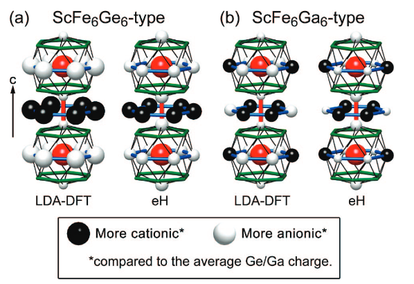

> 大概是一个从已有方向上的随机探索。

# 从 $\mathrm{TbMn}_6\mathrm{Sn}_6$ 开始说起

[1] J.-X. Yin et al., Nature 583, 533 (2020).
https://www.nature.com/articles/s41586-020-2482-7

$\mathrm{TbMn}_6\mathrm{Sn}_6$ 是一个明星材料了，属于是166家族里最火爆的，我们来看为什么。

首先，Kagome lattice 我们都知道是一个点，因为 nearest neighbor Kagome model 直接给出 Dirac point 和 flat band，虽然这只是一个最简单的 model，但也预示着有 Kagome 结构的化合物是值得注意的，Dirac point 自不必说，flat band 其实也有人观测到了。

这些丰富的性质，按照他们的话讲，叫 **often show correlated topological band structures**

> NN Kagome 的推导，会另写一篇文章

> 观测到 flat band 会另写一篇文章，需要注意他的 flat band 不能仅由 NN model 解释，而是另有来源，因为 NN model 的 flat band 并不是被保护的，而 Dirac point 是稳定存在的，这里我需要寻找来源。

而他们要找的则是所谓的 Chern insulator，他的性质叫 AQHE，也就是有 spontaneous breaking of time reversal symmetry，并且能带有 Chern number，在边缘有无耗散的 chiral edge modes，且由于绝缘体性质，在低温会有量子化的 Hall conductivity。这里把这个 edge model 称作 chiral，指的电流只有一个方向，从而有左右手不对称性。

> 模型上，QWZ model 和 Haldane model 都属于这类，10-fold way 中属于 A1，和 QHE 电子气是一类。

> 考虑 spin orbit coupling，Dirac point 处可能会打开 topological non-trivial gap，从而得到 topo physics，当然这不严谨。

为了最大地破坏 Kagome 层的 TRS，我们需要的是自发磁化 with magnetic momentum perpendicular to the Kagome plane. $\mathrm{TbMn}_6\mathrm{Sn}_6$ 正好满足这个条件，我们发现 Terbium 在这个环境是 easy axis，而 Dysprosium 和 Holium 是 easy cone，其他则是 easy plane。并且我们发现我们的 magnetic anisotropy 计算也符合这个结果。

:::important
稀土磁性为什么会有差异？我们接下来稍微解释
:::

那么换句话说，通过调控 R，就可以调控磁性性质，从而影响 Kagome 电子的，尤其是 Kagome 电子的状态，于是 Hasan 组就做了后续的实验 [2]。

# 稀土磁性和 anisotropy

我们知道对于内层的4f电子，SOC的作用要大于 crystal field quenching，因为他在内层。也就是说周边原子形成的晶体场，相对于4f电子本身的 Hund's rule 来说，是一个微扰。那么为什么 Terbium 和 Dysprosium 特殊？

对此，小编也不知道有什么定性的完美解释。最主要的理由还是内层4f电子的 orbital magnetic momentum 和 spin 是 locked，并且遵守 Hund's rule， 而 orbital momentum 对应电子云的分布，所以这个电子云和周围的 3d 电子存在 interaction。比如说 L=3 比 L=2 要扁，他的排斥形式可能就不太一样，L=3 能够在 001 方向能量就是最低的，而 L=3+2 可以斜着卡进去，再大就只能平躺，只能说大概符合这个趋势。具体的形式可能很不一样，理论上呢，这个 crystal field 的效果用 Stevens operators 去展开描述，简单来说就是展开成对称性允许的各种角分布的线性组合。

对于不同的稀土元素，诚然。那么对于同一种稀土元素不同的电子排布，其MAE不同也是可以想见的。从 [3] 可以知道，不同 orbital momentum 在 DFT 中的 self-interaction energy 是不一样的，导致 DFT favor non-Hund orbital states。不过由于这个 SIE 是 rotationally invariant，仍旧可以通过固定 m 的方法去得到 the correct MAE of the correct Hund state, 这也是我们文章中使用的方法。

> 我们正在探索 hybrid functional 能否缓解这个 SIE 的差异，并给出正确的

> 关于 VASP 和 Wien2k 中如何去做这个，会写一篇文章

> 关于 Stevens operators，会在这篇文章补充。

# 原子半径，磁性来源和结构多样性

调控还有一个方面，是稀土的原子半径大小，而我们已知的是，更大的半径会造成 $\mathrm{RFe}_6\mathrm{Ge}_6$ 的正交畸变 (orthorhombic distortion) [4]。那么一方面，更大的半径导致 chemical pressure 从而导致结构上的畸变，但是在RMnSn里没有这样的畸变。另一方面，半径也会影响 4f 和 3d 之间的相互作用，这预示我们可以去调 Kondo 或者 RKKY physics -> 稀土磁性。

[2] indicates that 二阶 3d-4f hopping 是一个可能的机制，并且实验上也能观测到 R 和 Mn 的 moments align (那些 ferrimagnetic states)，对于 AFM 的 Er 就更花，有 triple-spiral magnetic ordering [5]。

> 具体的机制待补充，希望我能看懂

在结构变化方面，一个重要的理论是 chemical pressure 和 electrostatic energy 的竞争 [6]。chemical pressure 更多的是稀土原子对 Fe-Ge cage 的挤压作用，而 electrostatic energy 则像是一种弹性的东西，像是水波一样。这里我们具体讨论这篇文章：

# Venturini Paper

我们来仔细读一下这篇 paper，他要讨论的问题往大了说，是 superstructures of the host lattice arising from stuffinf patterns，并且指出他在XRD中的影响难以看出。对于R166，the inclusion of a guest atom into one of these cavities pushes away the Ge sites at the top and bottom of the void space from the void center, making the two adjacent voids inaccessible. The unstuffed cavities are thus occupied by $\mathrm{Ge}_2$ dumbells. 

然后横向的，有不同的 occupation patterns，也就是我们称为AABB, ABAB的那些东西。两个极端分别是 ScFe6Ge6，all columns are strictly in-phase. 和 ScFeGa6，where every other column is shifted half a unit cell along a axis, giving rise to rows of internally in-phase arrangements. 除了 ScNi6Ge6 和 LiNi6Ge6 types，其他的都是正交条纹状。

通过观察到Ga/Ge ratio的调控带来的结构变化，分析出电子浓度带来的静电效应是 favor AAAA structure 的。就需要看 section 4 和 section 5。

为了描述这种AAABBB...的 occupation pattern，引入 RP sequence "AAABB"，也就是排列的最小周期单元，其周期记为$n_\mathrm{sc}$，而$n_\lambda$为一个原胞内 RP sequence 的数目。二维可以类似的用 q-vector 来描述。

接下来的观察是，他们DFT的结果和我们差不多的，NM 情况都是一个 peak 表示 Localized 3d electron，在引入磁序之后劈裂。而结构并不怎么影响电子，调整Ga,Ge的唯一作用是改变 chemical potential，也就是往费米面注入电子。(类似的情况可以想到如何调控半导体的费米面) 这让我们会想起最密堆积的 stacking fault 只需要很小的能量，而且也有观察说是 superstrucutre 依赖于合成条件。

于是他们看了实空间电子分布，for teasing out the origins of superstructure ordering, 更具体的说，是 Ge 原子的电荷分布随这个调控分布巨大。

我们来看这张图。AAAA type 和 ABAB type 的 Ge 原子电荷不一样，AAAA 是低能量的均匀分布，而 ABAB 虽然把 steric effect 缓冲了，但是静电能量的增大补偿回来了，同时我们看到这个静电能量也造成 Ge 乃至 Fe 晶格的正交畸变。排列的原则是 R 正离子旁边需要有Ge负离子来稳定。并且这个静电能像 domain wall 一样只在边界内出现，在所谓的 bulk 区域，电荷则基本还是均匀的。

:::important
能否使用一个模型来解释这一 pattern 的变化？
:::

我们只从 DFT 计算结果知道的是：domain wall 的静电能量补偿很大，但是衰减的比R-R之间的应力要快很多，因此 $J_1 < 0$ 而 $J_2 > 0$，并且其实在 $J_2$ 外面还有其他的相互作用。具体如何，之后再说吧。

# 参考文献

[1] J.-X. Yin et al., Nature 583, 533 (2020).

[2] W. Ma et al., Phys. Rev. Lett. 126, 246602 (2021).

[3] Y. Lee et al., npj Comput Mater 11, 168 (2025).

[4] G. Venturini, R. Welter, and B. Malaman, Journal of Alloys and Compounds 185, 99 (1992).

[5] S. X. M. Riberolles et al., npj Quantum Mater. 9, 42 (2024).

[6] D. C. Fredrickson et al., J. Am. Chem. Soc. 130, 8195 (2008).

