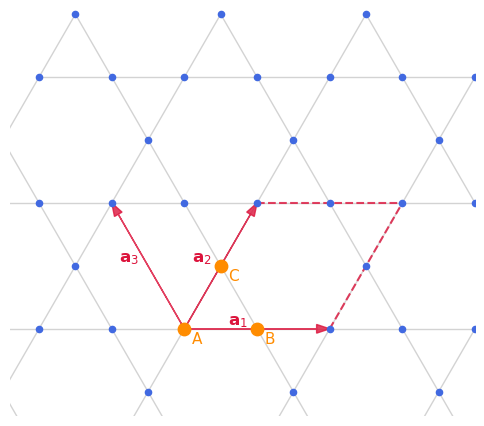
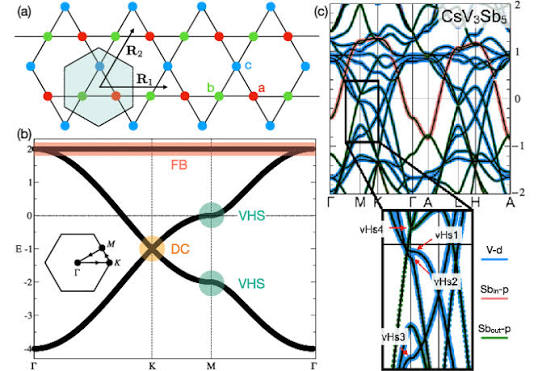

# $\mathrm{TbMn}_6\mathrm{Sn}_6$ continues

> 为了继续我们的研究，我们需要梳理 TbMnSn 的进展，因为这是个明星材料。

上集我们讨论了 R166 体系的晶格结构的性质，很不幸的这是我自己的研究课题之一，所以我还是得继续写这些系列文章。

我们还没有讨论清楚 TbMn$_6$Sn$_6$ 的性质，让我们来顺着这篇文章继续 [1]。首先，磁性是一个 ferrimagnet，Tb 朝下而所有 Mn 朝上。

从 STEM 图像可以得出 SnTb 平面和 Mn 平面的间距最大，因此 Mn 平面可以被剥离出来。弄出一个好的表面以后进行 STM 测量。

对 Mn 平面的 STM 在 $B = \mathrm{T}$ 发现了 Landau quantization，也就是 dI/dV 曲线当中许多local的峰，相当于态密度，而 TbSn 平面没有这个 Landau quantization。其他 kagome 材料没有 Landau quantization，说明 TbMnSn 处在所谓 quantum limit。这个词明显是他们捏的，我感觉只是再说低温下 Landau quantization。

通过分析 Landau fan，也就是纵轴 V，横轴 B，dI/dV 是颜色的图，可以分析能带。3个证据表明他是一个 Chern gap。 1. zero-field peak shifts linearly to lower energy with increasing field 而非 split，说明已经是 spinpolarized。2. 其他峰 $ \mathcal{E}_n = \sqrt{nB} $ 3. 上面有个态，说明有个 Chern gap

测量发现 g factor 很大，可能是轨道贡献; ARPES 给出 BZ 顶点的 Dirac cone，并且 gap 随磁化强度增长，说明来自 intrinsic SOC。

观测到了 quasiparticle scattering reduced edge state。

测到了 AHE 信号，并且 $ \rho_{\text{AH}} = A + \sigma^{\text{int}}\rho_{xx}^2 $ 得到的 intrinsic Hall conductivity 和理论估计 $ \sigma_{xy} = \frac{\Delta}{2E_D} \times e^2/h $ 是一致的。这些就说明了 TbMn6Sn6 基本上是一个 Chern magnets with kagome electron. 注意他是 metal 当然 transition metal kagome 一般意味着 correlated。

剩下的疑点就是理论上的了，我们需要解释清楚这里的各种理论。

## Landau level of Dirac electrons

从 Dirac Hamiltonian 开始：

$$
\mathcal{H} =v_{F}( \sigma _{x} \Pi _{x} +\sigma _{y} \Pi _{y})
$$

其中 $\Pi =p+eA$，取对称规范有

$$
[ \Pi _{x} ,\Pi _{y}] =-i\hbar eB
$$

定义

$$
a=\frac{\ell _{B}}{\sqrt{2} \hbar }( \Pi _{x} -i\Pi _{y})
$$

则 Hamiltonian 转化为

$$
\mathcal{H} =\frac{\sqrt{2} \hbar v_{F}}{\ell _{B}}\begin{pmatrix}
0 & a\\
a^{\dagger } & 0
\end{pmatrix}
$$

可以看出本征波函数有这样的形式：

$$
\Psi _{n} =\begin{pmatrix}
u|n-1\rangle _{a}\\
v|n\rangle _{b}
\end{pmatrix}
$$

其中 $|n\rangle _{a,b}$ 是在各自能带中的 Landau level 本征态，代入以后消除 $u,v$，得到

$$
E^{2} =\frac{2\hbar ^{2} v_{F}^{2}}{\ell _{B}^{2}} n\Longrightarrow E_{n} =\pm v_{F}\sqrt{2e\hbar Bn} +E_{D}
$$

最后加上了 Dirac point 所处的能量 $E_{D}$。如果存在质量项，那么

$$
E_{n} =\pm v_{F}\sqrt{2e\hbar Bn+\Delta ^{2}} +E_{D}
$$

我们就得到了文献里的形式

## SOC and the opening of a Chern gap

关于 SOC 的作用，我们先从 graphene 的两个 Dirac point 说起。两个 dirac points 分别在 $\mathrm{K}$ 和 $\mathrm{K}^{\prime }$，并且有自旋简并，所以在一般情况下是4重简并。如果有自发磁化或者外加磁场，则 spin symmetry 没了，变成二重简并。

单个自旋下，Dirac Hamiltonian 写成

$$
H_{0,\tau } =v_{F}( \tau q_{x} \sigma _{x} +q_{y} \sigma _{y})
$$

其中，$\tau =\pm 1$代表了$\pm K$，也就是 valley 自由度。因为两个 Dirac point 的 $q_{x}$ 反号，两个 Dirac point 的 chirality 相反。

什么叫 chirality 相反？我们回到 $\mathbf{k}\rightarrow \mathbf{d}(\mathbf{k})$ 映射，当$\mathbf{k}$绕两个 Dirac 点逆时针转一圈时，$\mathbf{d}(\mathbf{k})$也绕一圈，因此转动方向是相反的，所以得到的 Chern number 也是相反。

为什么会这样？ 暂时不考虑TRS的话，graphene 是有空间反演对称性的，由$P=\sigma _{x}$来描述。因此

$$
\mathcal{H}_{K^{\prime }}(\mathbf{q}) =P\mathcal{H}_{K}( -\mathbf{q}) P^{-1} =v( -q_{x} \sigma _{x} +q_{y} \sigma _{y})
$$

导致 chirality 相反。因此加上普通质量项则 Berry curvature 积分抵消，SOC term 对 $\pm K$ 给出相反的质量，从而成为 Chern insulator。值得一提的是 TRS 也能保证这件事。

加入 Kane-Mele 型 SOC，低能形式为 $\lambda _{SO} \tau s_{z} \sigma _{z}$，时间反演下，$\tau \rightarrow -\tau ,s_{z}\rightarrow -s_{z}$，是不变的。因此单个自旋，SOC 在不同的 $K$ 产生相反符号的质量。再加上两个 valley 的 chirality 相反，导致两个 valley 的 Chern number 是相加的，得到 Chern insulator。

可以这么想，SOC 是把轨道 $\mathbf{k}$ 和自旋 $S$ 联系起来的，从而对不同的 chirality 给出相反质量项，而 Berry curvature 的符号则是 $\varpropto \mathrm{sgn}( m) \tau $。关于 SOC 之后再仔细讲。

## Dirac AHE theory and experiments.

我们知道单个半充满 Dirac cone 带 $m$ 给出的总 Berry curvature 是 $\pm \frac{1}{2}$，问题是，如果并没有完全占据，那么Berry curvature 只有到 $k_{F}$ 的积分，这里假设了 Dirac point 的能量是 0 而 $\mathcal{E}_{F} \neq 0$：

$$
\int _{k_{F}}^{\infty } k\mathrm{d} k\ \frac{mv^{2}}{2\left( v^{2} k^{2} +m^{2}\right)^{3/2}} =\frac{1}{2}\frac{m}{\mathcal{E}_{F}}
$$

如果转而规定费米能级为零，那么上面公式的 $\mathcal{E}_{F}$ 应该换成 $E_{D}$ 也就是 Dirac point 所处的能量，导带的讨论类似。

实验上，电导率张量给出
$$
\rho _{xy} =-\frac{\sigma _{xy}}{\sigma _{xx}^{2} +\sigma _{xy}^{2}}
$$

在霍尔电导很小的情况下，

$$
\rho _{xy} \approx -\frac{\sigma _{xy}}{\sigma _{xx}^{2}} \approx -\sigma _{xy} \rho _{xx}^{2} +A
$$

其中$A$包括散射下公馆的 extrinsic contribution 例如 skew scattering，而 $\sigma _{xy}$ 一般包含 intrinsic 也就是 Berry curvature 导致的，以及 side jump，也就是被杂质散射后波包中心的位移。文章就是用这个公式得出的。

# Kagome band 的性质，以及推导

kagome lattice 是一个六角晶格，我们写出：

我们需要用到：
$$
\mathbf{r}_{A} =0,\mathbf{r}_{B} =\frac{\mathbf{a}_{1}}{2} ,\mathbf{r}_{C} =\frac{\mathbf{a}_{2}}{2} ,\mathbf{a}_{3} =\mathbf{a}_{1} -\mathbf{a}_{2}
$$
在标号完成后，我们写出所有的 hopping:

A-B 有
$$
H_{AB} =-\frac{t}{2}\sum\limits _{\mathbf{R}}\left( a_{\mathbf{R}}^{\dagger } b_{\mathbf{R}} +a_{\mathbf{R}}^{\dagger } b_{\mathbf{R} -\mathbf{a}_{1}} +\mathrm{h.c.}\right)
$$
A-C 有
$$
H_{AC} =-\frac{t}{2}\sum\limits _{\mathbf{R}}\left( a_{\mathbf{R}}^{\dagger } c_{\mathbf{R}} +a_{\mathbf{R}}^{\dagger } c_{\mathbf{R} -\mathbf{a}_{2}} +\mathrm{h.c.}\right)
$$
B-C 有
$$
H_{BC} =-\frac{t}{2}\sum\limits _{\mathbf{R}}\left( b_{\mathbf{R}}^{\dagger } c_{\mathbf{R}} +b_{\mathbf{R}}^{\dagger } c_{\mathbf{R+a}_{1} -\mathbf{a}_{2}} +\mathrm{h.c.}\right)
$$
加起来后得到总的 Hamiltonian，再通过定义 Fourier 变换
$$
c_{\mathbf{R,r}_{i}} =\frac{1}{\sqrt{N}}\sum\limits _{\mathbf{k}}\mathrm{e}^{i\mathbf{k} \cdot (\mathbf{R} +\mathbf{r}_{i})} c_{\mathbf{k} ,i}
$$
注意这里对每个不同的 site 取的规范不同，在定义
$$
\Psi _{\mathbf{k}} =\begin{pmatrix}
a_{\mathbf{k}}\\
b_{\mathbf{k}}\\
c_{\mathbf{k}}
\end{pmatrix}
$$
最后得到
$$
H=\sum\limits _{\mathbf{k}} \Psi _{\mathbf{k}}^{\dagger }\mathcal{H}(\mathbf{k}) \Psi _{\mathbf{k}}
$$
其中
$$
\mathcal{H}(\mathbf{k}) =-t\begin{pmatrix}
0 & \cos\left(\frac{\mathbf{k} \cdot \mathbf{a}_{1}}{2}\right) & \cos\left(\frac{\mathbf{k} \cdot \mathbf{a}_{2}}{2}\right)\\
\cos\left(\frac{\mathbf{k} \cdot \mathbf{a}_{1}}{2}\right) & 0 & \cos\left(\frac{\mathbf{k} \cdot \mathbf{a}_{3}}{2}\right)\\
\cos\left(\frac{\mathbf{k} \cdot \mathbf{a}_{2}}{2}\right) & \cos\left(\frac{\mathbf{k} \cdot \mathbf{a}_{3}}{2}\right) & 0
\end{pmatrix}
$$
简写成
$$
\mathcal{H}(\mathbf{k}) =-t\begin{pmatrix}
0 & c_{1} & c_{2}\\
c_{1} & 0 & c_{3}\\
c_{2} & c_{3} & 0
\end{pmatrix}
$$
最后得到
$$
E_{\text{flat}} =-t,\ E_{\pm } =-\frac{t}{2}\left( 1\pm \sqrt{3+2\sum\limits _{j=1}^{3}\cos(\mathbf{k} \cdot \mathbf{a}_{j})}\right)
$$

这个平带来自于 compact localized state 的干涉条件，也就是一个电子从某个点出发可以回到本身，而微扰会破坏这个条件从而破坏平带。对了 destructive interference 也是形容这种平带的词语。

模型的能带图大概长 (b) 这样，这张图还是比较重要的：

# TbMnSn 的其他性质，以及思路

:::important
我们目前知道的信息只有：TbMn6Sn6 的 AHE 和 Landau fan，以及 massive Dirac cone。至于这个表面测量到的 Dirac cone 到底是什么，仍然在争论，在下一篇笔记中，我们会援引两三篇文章来说明这个问题。简单来说，在 bulk 里面并没有费米面附近的 Dirac cone，而 AHE 来自于别的能带的贡献比较大。
:::

[2] L. Gao et al., Applied Physics Letters 119, 092405 (2021). 

> 其他 R 元素的 AHE 还有 thermal Hall 还有 Nernst effect

[3] W. Ma et al., Phys. Rev. Lett. 126, 246602 (2021).

> 调控 R 元素来调控 Chern gap

[4] S. X. M. Riberolles et al., Phys. Rev. X 12, 021043 (2022).

> Mn 层间有 AFM 和 FM 的竞争，且所有 RMS 中都存在。Tb 的 R-Mn 作用比较强所以 Mn 是 FM 的，如果作用变弱可能会有竞争。

[5] S. X. M. Riberolles et al., Nat Commun 14, 2658 (2023).

> 研究 310 K 左右发生的 spin reorientation。Mn 是 easy plane 而 Tb 是 easy axis。加热以后削弱了 Tb 的 anisotropy 变成各个态都有占据，文章把他等效成一个 uniaxial 和一个 isotropy 态的竞争，比较粗略不够本质，下面有更本质的说法。

[6] X. Xu et al., Nat Commun 13, 1197 (2022).

> 继续用 Dirac fermion 模型研究 AHE, A thermal Hall, A Nernst effect。所谓的 charge-entropy scaling 就是 Wiedermann-Franz law，发现 Chern gapped Dirac model 可以描述热导率和电导率之间的关系。

[7] C. Mielke Iii et al., Commun Phys 5, 107 (2022).

> Ferrimagnetic 不是刚性的，在 120 K 左右他的 fluctuation starts to diminish

[8] Z. Huang et al., Phys. Rev. B 109, 014434 (2024).

> 一个我觉得有道理的 model about spin reorientation，考虑 exchange + CEF driven anisotropy 以后的完整 model

[9] R. S. Li et al., Phys. Rev. B 107, 045115 (2023).

> 研究这里得到的optical conductivity，特点是有一个 frequency independent plateau，并且发现这里有其他 trivial bands 的参与。

> 这里可以学习如何用 DFT 算 optical conductivity

[10] W. Zhao et al., Nat Commun 16, 6837 (2025).

> 室温可调的 quantum metric effect，因为他首先是 topological 的，那么在此之上有无二阶的响应呢？他们说有，这个我们讲 quantum metric 基础的时候再仔细讨论

[11] Q. Wei et al., Phys. Rev. B 111, 064412 (2025).

> 引入 Mg 替代 Tb，可以增强 intrinsic Hall（我猜是纯 chemical potential 类的）同时增强 extrinsic skew scattering 造成的 anomolous Hall，还要仔细研究。

> 这里也有 DFT 的部分

[12] Y. Okamura et al., npj Quantum Mater. 8, 57 (2023).

> 红外磁光测到 A Hall resonance，这个机制我不知道。

[13] D. C. Jones et al., Phys. Rev. B 110, 115134 (2024).

> Dirac fermion 并非 Kagome-derived

> 我们的文章，在下一篇笔记中详述。由此看来 spin-reorientation 的图像很清晰，并且这个图像至少可以被推广到 YbFe6Ge6, yet another AHE 166 driven by so-called spin fluctuation

:::tip
这是个可以考虑的方向。
:::

# 参考文献

[1] J.-X. Yin et al., Nature 583, 533 (2020).

[2] L. Gao et al., Applied Physics Letters 119, 092405 (2021). 

[3] W. Ma et al., Phys. Rev. Lett. 126, 246602 (2021).

[4] S. X. M. Riberolles et al., Phys. Rev. X 12, 021043 (2022).

[5] S. X. M. Riberolles et al., Nat Commun 14, 2658 (2023).

[6] X. Xu et al., Nat Commun 13, 1197 (2022).

[7] C. Mielke Iii et al., Commun Phys 5, 107 (2022).

[8] Z. Huang et al., Phys. Rev. B 109, 014434 (2024).

[9] R. S. Li et al., Phys. Rev. B 107, 045115 (2023).

[10] W. Zhao et al., Nat Commun 16, 6837 (2025).

[11] Q. Wei et al., Phys. Rev. B 111, 064412 (2025).

[12] Y. Okamura et al., npj Quantum Mater. 8, 57 (2023).

[13] D. C. Jones et al., Phys. Rev. B 110, 115134 (2024).