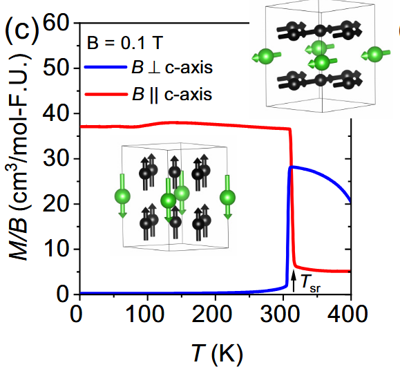
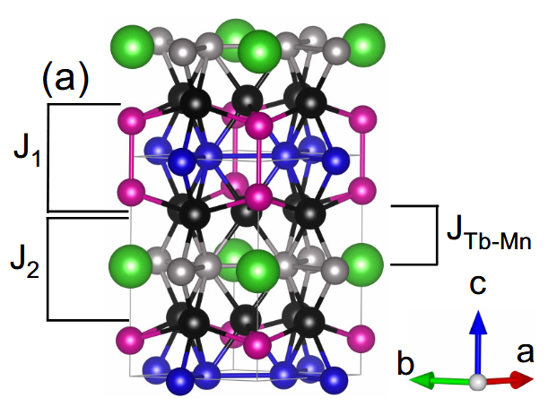

# 如何解释一切

我们上回只说了这篇文章：[1] J.-X. Yin et al., Nature 583, 533 (2020).

他核心的思想是测到了 AHE，然后通过*表面*的 STM 测量测出 Dirac cone，从而和 Kagome model 建立联系。

然而 TbMnSn 很明显是一个 3D 的东西，虽然有 Dirac cone，但是他是否源于 Kagome-derived，不得而知。

Igor/Nirmal 的文章说不行。

[2] D. C. Jones et al., Phys. Rev. B 110, 115134 (2024).

## TbMn6Sn6 的磁性

我们先列举磁性有关的现象：

1) 低温下，是 out of plane ferrimagnet。
2) 在 309 K 左右有一个 spin reorientation，可以被外场催化，高温下是 planar ferrimagnet。在下面这张图里很清楚

3) 根据 [3] C. Mielke Iii et al., Commun Phys 5, 107 (2022). 有涨落

怎么考虑？首先，YMn6Sn6 是一个 spiral 的 magnet

交换作用有 $J_1 < 0, J_2 > 0, J_3 < 0$，但是加入 Tb 之后，有一个很大的 $\tilde{J}_2 < 0$ 盖过 $J_2$ ，导致没有任何 frustration。

再加上 anisotropy，Mn 是 easy-plane，Tb 是 easy-axis。由于 strong Tb-Mn exchange，温度降低后 Tb 的 anisotropy 显著增强，把 Mn 带过去。Tb 的 anisotropy 有六阶甚至四阶项，所以在低温下很强。

剩下的就是定量比较 MAE 的大小和温度依赖，都能用中子散射拟合，也可以用 DFT 计算。

:::notes
我们发现其实 spin reorientation 和 AHE 在 YFe6Ge6 当中也是有的，类似的，我们也需要考虑 Fe-R exchange 带来的磁结构，以及对电子带来的影响。我们研究这个机制的另一原因。
:::

同时要注意有 magnon，并且可能在霍尔电导中有贡献。

## 学习：交换作用如何得到
> 

## TbMn6Sn6 的体相电子性质和 AHE
> D. C. Jones et al., Phys. Rev. B 110, 115134 (2024)
最主要的信息：

1. anomolous Hall conductivity 其实是 $\rho_{xx}$ 的一个级数展开：$\sigma_{xy}^A = a\sigma_{xx}^2 + b \sigma_{xx} + c + d / \sigma_{xx} + \cdots$，在高温下，最后一项很重要，可能来自于 magnon-electron scattering，但是之前的实验没有考虑。这个 magnon 的理论暂时没见到。
2. 有 Dirac cone，但是这个 Dirac cone 不是 Mn d-electron 的 Dirac cone。AHE 算出来的也接近实验的量级，这些 Dirac 来源未知就是了。

我们来看看怎么看出来的。

Fig.4(a): 高温下，$\rho_{yx}$ 和 $M$ 的走向一致，且低温下都有 hysteresis。说明 AHE 强度和磁化强度明显相关，那么根据逻辑，磁化强度的涨落也就是 magnon 一定会造成影响。低温下磁滞回线看不清导致很难测量 $\rho_{yx}$.

Fig.4(b)(c): 主要就是说 $d / \sigma_{xx}$ 项的问题

第二个看能带就能看出来，需要补充的是关于 AHE 的理论。

## 4f 磁各向异性的 DFT 计算：暴力法

我们在此总结一下目前使用的暴力法计算 MAE 的流程。首先是取 DFT + U without SOC，取一个大的 U 并且固定 occupation matrix 为满足 Hund's rule 的，计算得到一个电荷密度。在此基础上，加上某个方向的 SOC，并且旋转相应的 occupation matrix（我们有一套代码）再固定，就能暴力解出 MAE，之后可以做拟合等等操作。

不过在此之上，做一个 MAE 有关的理论，包括 Stevens operator 等等，也是有必要的。

最简单的 MAE 项就是 所谓的 $ K S_z^2 $, 如果 $K < 0$ favor easy axis，$K>0$ favor easy plane，也写成 $\cos ^2 \theta$ 形式，using the general definition of spherical coordinates. 也要注意有 $\sin ^2 \theta$ 的定义。

