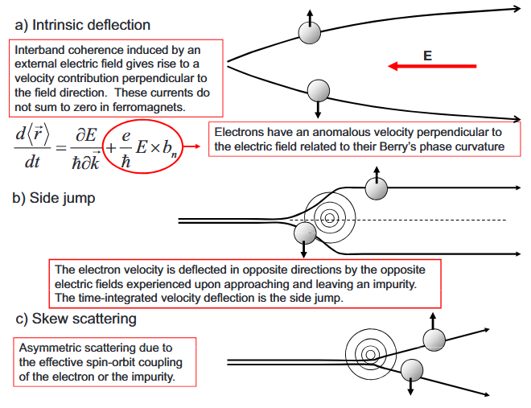

# AHE 现象和三种机制
所谓 AHE 当然要从实验上定义，也就是在没有外磁场下，加 $x$ 方向电场有 $y$ 方向电流这个事情。经验上对 AHE 材料，$\rho _{xy}$ 正比于磁化强度 $M$。
$$
\rho _{xy} =R_{0} B+R_{s} M
$$
并且 $R_{s} \gg R_{0}$。在远古 (<1930) 经常作为 smoking gun of FM order，比 dichorism 和 Kerr / Faraday effect 要看的更清楚。

理论上，Luttinger 给出一个无耗散的 intrinsic 机制，现在我们知道就是由于能带的 Berry curvature 导致的，并且要 spin-splitted，这个 intrinsic 和 scattering 没有关系。还有 Smit 提出的 skew scattering 机制，也就是自旋依赖的散射；以及 Berger 提出的 side-jump，也就是自旋依赖的速度拐弯，which is subtle in its concepts。两种 extrinsic 的机制，都可以考虑为自旋劈裂的能带电子在 potential 中运动的结果。三种机制都是存在的，他们有什么特点呢？

Intrinsic 的贡献我们发现就是能带 Berry curvature 的积分，这是 Kubo formula 推出来的，并且成功解释了 Chern insulator 的量子化现象。从而有一个 scaling 关系
$$
\rho _{xy} \varpropto \rho _{xx}^{2}
$$
这个关系在之前的文章中推过了，本质上是由于电阻率张量是电导率张量的逆，从而分母上出现了 $\rho _{xx}^{2}$，也就是：
$$
\sigma _{xy} =\frac{\rho _{xy}}{\rho _{xy}^{2} +\rho _{xx}^{2}} \Longrightarrow \rho _{xy} \approx \sigma _{xy}^{\text{intr}} \rho _{xx}^{2} \varpropto \rho _{xx}^{2} \varpropto \tau ^{-2}
$$

Skew-scattering 由于是 $\sigma _{xy}^{\text{skew}} \varpropto \tau $，导致 $\rho _{xy}^{\text{skew}} \varpropto \tau ^{-1} \varpropto \rho _{xx}$。而 side-jump 发生的 $\sigma _{xy}^{\text{ss}} \varpropto \tau ^{0}$，所以和 intrinsic 是混在一起的，一般性来讲有：
$$
\sigma _{xy} =a\rho _{xx}^{2} +b\rho _{xx} \ ( +c)
$$
通过拟合就可以得到 skew-scattering 和 intrinsic (如果假设 side-jump 很小的话)

下面我们通过 Boltzmann equation 解释为什么两个 extrinsic 是这样的表现：首先来看散射项，两种外在的杂质散射都可以通过对于杂质 potential $U(\mathbf{r})$ 的 spin-dependant scattering 来解释：
$$
H_{\mathbf{k} ,\mathbf{k}^{\prime }}^{\text{dis}} =U_{\mathbf{k} ,\mathbf{k}^{\prime }}\left( 1-i\lambda \mathbf{\sigma } \cdot \left(\mathbf{k} \times \mathbf{k}^{\prime }\right)\right)
$$
skew scattering 表现为 asymmetric transition，因为只有这种 non-reciprocity 才能导致 Hall 电流。这个不能只用 Born approximation，因为 $| H| ^{2}$ 只能给出对称项。必须至少展开到一阶和二阶的干涉项，才可以可以给出反对称的跃迁概率 linear to $\lambda $：
$$
W_{\mathbf{k} ,\mathbf{k}^{\prime }}^{A} =-W_{\mathbf{k}^{\prime } ,\mathbf{k}}^{A}
$$
由于这个跃迁概率同样正比于杂质浓度，因此 skew scattering rate 和 Drude scattering rate 的比值和杂质浓度无关。
$$
\frac{W_{\mathbf{k} ,\mathbf{k}^{\prime }}^{A}}{W_{\mathbf{k} ,\mathbf{k}^{\prime }}^{S}} =\alpha _{\text{skew}}
$$
那么 $j_{\text{skew}} \approx \alpha _{\text{skew}} j_{s}$，而普通电流 $j_{s} =\sigma E\varpropto \tau $，因此便可以大致得到
$$
\sigma _{xy}^{\text{skew}} \varpropto \tau 
$$

而 side-jump 则可以看作是以 $1/\tau $ 的频率 (同样正比于杂质浓度，因此可以用 Drude $\tau $) 给予横向的位移 $\delta y$，但是这需要分布的不平衡。这个不平衡由外加电场导致，量级大约是$\varpropto \tau $，因为在电导的图像中，大概是整个费米面在动量空间向右移动了 $\tau $ 之后再跳回来，所以这个分布的不平衡平均下来$\varpropto \tau $。二者结合得到 $\sigma _{xy}^{\text{ss}} \varpropto \tau ^{0}$ 的依赖。

于是：根据 $\tau $ 的大小，可以分为几个区域。记得普通金属电阻率 $\varpropto \tau ^{-1}$，是 $T$ 和 $T^{5}$ 两个区间。当然也要看 $\tau $ 本身的大小。大概可以写成
$$
\sigma _{xy} =A\tau ^{-2} +B\tau ^{-1} +c
$$
如果 $\tau $ 比较大 / 往往低温，则 skew scattering 主导，good metal regime 是 $\tau ^{-1}$ 主导，还要注意分辨 intrinsic 和 side-jump，如果是 low mobility regime，导电靠 hopping 完成，上面的图像可能不适用了。