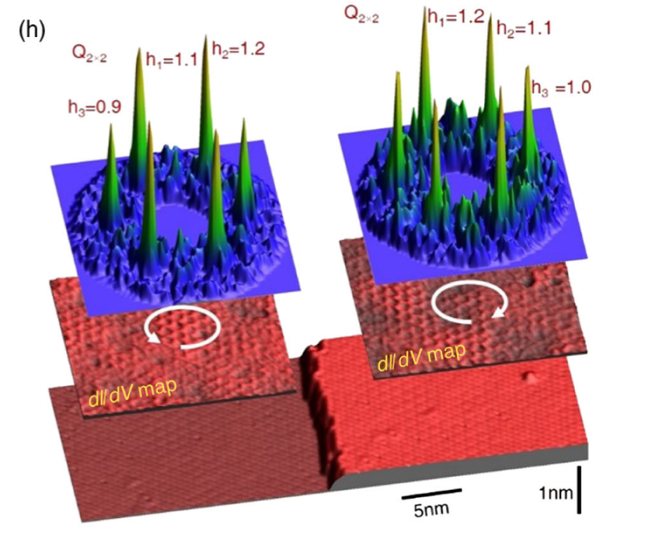

# FeGe 中的 CDW

FeGe 是我研究的东西的一个母材料，很不幸地我要把他放在我的 introduction 里面，所以必须得写一个笔记。

我们先以第一篇实验文章为参考，也就是

[1] X. Teng et al., Nature 609, 490 (2022).

之后再研究在此基础上的修正。

## CDW 的发现

首先是磁序。有一个 Neel 温度 $T_N = 410 \mathrm{K}$, 并且在 60 K 还有一个 canting。那么他们用的方法有 magnetization, transport ($\rho_{xx}$ 和 $\rho_{xy}$)，neutron and X-ray, STM, ARPES。

先来看 magnetization，两个核心的结果是：CDW 在转变温度增强了磁矩的强度，以及在转变温度附近，垂直于 $c$ 轴的 $\chi_{a}$ 有降低，可能是由于费米面的态密度被抑制。

然后 transport，纵向电导率的导数在 $T_{CDW}$ 降低，注意他是个金属，近似的有 $\rho = AT + \rho_0$ 这么拟合，而 $A$ 和费米面态密度有关的。而 Hall 系数（这里 Hall effect 是线性的）也是一个降低。而这个转变温度前后，磁序没有变，说明可能是 CDW。同时 CDW 还带来一个 chiral flux of circulating currents，暂时不知道是什么东西

> 待补充：chiral flux

$c$ 方向的磁场加的够大会有 spin flop ，就是自旋取向变成 $ab$ 平面内了，AHE 效应主要发生在这里，说明 CDW 和磁性是有关系的。AHE 可以在 AFM 内由自旋纹理（topo Hall）或者磁场诱导的 magnetization 获得，具体什么机制，还不明确，毕竟目前我们只关心 CDW。

> spin-flop 主要是来源于 Zeeman v.s. MAE，理论上翻过去以后不会严格共线而是会有小磁化 by GPT

接下来看 XRD 和 neutron，假设我们原来晶胞的 reciprocal lattice vector 是 $\{\mathbf{b}_1,\mathbf{b}_2,\mathbf{b}_3\}$，那么如果有 $(hkl)$ 不是整数的 diffraction peak 出现，说明原来的周期在 neutron 意义下不再是周期，而周期扩大成 $1/h,1/k,1/l$ 如果为零就是没有变化。

neutron 得到 AFM peak $(0,0,1/2)$ 就是 $c$ 方向上 Fe 两层的 AFM，而 CDW peak 是 $(1/2,0,0), (1/2,0,1/2)$ 两个峰。注意由于 hexagonal 对称性实际上 $a,b$ 平面有 6 个峰，见 Fig.3(h)。这些 CDW peak 延伸到 large $|Q|$，而 AFM peaks 在这些地方是已经削弱了。如果继续降温以至于 canting 了，AFM peak 会劈裂。CDW peak 在 canting 以后不变。并且 CDW peak 的 correlation length 是短程的。

STM 的证据则是两个，一是 CDW 温度以下态密度压低，二是实空间确实有 $2\times 2$ 周期性，铁证如山。

最后看一下原因，他们认为是电子结构导致的，测了 ARPES 发现了 VHS，不过到这里我们就需要补充 CDW 理论，以及一些杂七杂八的东西了。主要就是两个 VHS 作为高 DOS 点被这个 Q 连接了，不过这个 Q 是什么造成的不知道。

VHS 怎么看呢？找 ARPES 两个方向的切片得到马鞍面，同时又有 k-resolved DOS 或者 spectral function peak 就是了。这里找到 3 个。

> 注意 $k_z$ 是调光子能量来测的。

Discussion 的卖点是 AFM 先于 CDW，并且 CDW 增强 AFM 有一个互动，在之前材料里没有

## 低温 spin-polar. STM

之后他们组又做了 liquid helium temp. 下的 STM 测量。首先 cleavage 这块，两个面都能剥离出来，而 Fe kagome plane 的原子不能很好 resolved，这在很多其他化合物里也是这样。然后还是观察到 $2\times 2$ vector peak，但同时三个 peak 的强度有区别，他们说这个 resmebling chiral charge order in Sb surfaces in AV3Sb5，能得到一个逆时针的 chirality。

gap 也测到了，在 gap 的两端的电压，实空间的电荷密度反转，这是 CDW 的特征。CDW 就是说有一些电子分布调到更低的能量，有些调到更高的能量了，所以是这样的。

他们的疑惑点在于这是否是一个 topological charge order，那么利用 spin-polar. STM 他们先确认了 AFM，然后看相邻 Fe layer 的 charge order，发现不同自旋层的 charge order 是相反的，和 internal mag. field 造成 chirality different 的图像相符，SbVSn 则是外磁场可以调控。

topo charge order 在理论上会造成 Berry curvature induced weak orbital magnetism，和 enhanced magnetic moment below CDW temperature 是 consistent 的，

然后根据 b.b.c. 不同层交界地方有 edge mode inside the CDW gap，这个是通过 STM 确认了 zero mode reside in the gap and in real space it is local.

并且他是一个 Fermi-level edge state (?)，和 large AHE just below CDW temp. 是一定程度上对的上。

最后提一嘴是这个东西作用在于 chirality，那么利用 S/C 的 proximity effect 可能可以弄 majorana，这是炒作的点之一。

这张图就显示了 chirality 的表现，那么它在实空间表现为什么？为什么会有 edge mode？这是一个需要看的问题，我们来看理论上这个 topo charge order 是怎么回事。

另外，这篇文章也只是说明了有 topo charge order, 而 chiral flux 是其中的一种。需要注意。

## Topo Charge Order 理论

