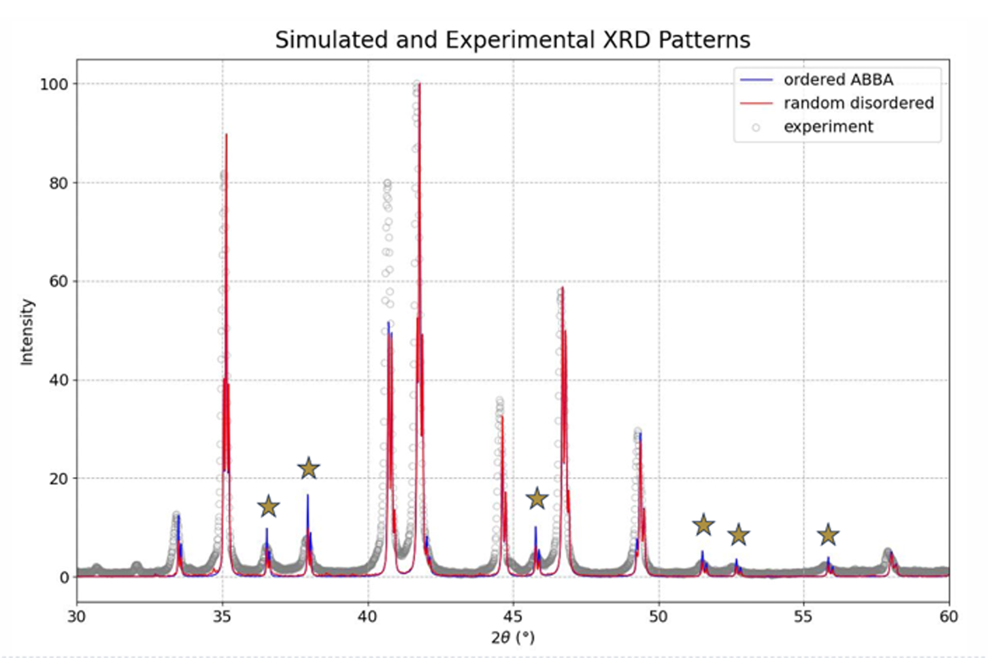

这篇文章列举 RFe6Ge6 的大部分实验，他们背后的分析以及疑点。

# TbFeGe6 文章 I

我们先来看结构和磁性，其标准结构是 CmCm 空间群的，并且在高温下是一个 AFM [1]，其来源是 Fe kagome planes。由于比较强的 direct exchange，Fe kagome plane 内的 FM moment align，但是面之间是 AFM。这是在室温下的性质。

> RMn6Sn6 的一个理论表明，Mn 同时有 AFM 的倾向和 FM 的倾向 [2]，而 TbMn6Sn6 的 FM 是由于强的 Tb-Mn exchange [3]，并且他们同时产生 order 同时消失 [4]。由于 AFM，R 受到的分子场为零，因此他们是 indepedent ordering [1,5]。于是顺着这个思路，我们就可以独立地处理 Tb 之间的 exchange。

More intersting is the two papers about Tb ordering and atomic disorder，我们先来看 [6] 做的 XRD 和 neutron：

## Introduction

首先, Venturini 的合成 paper [7] 在 samples annealed at 900 degrees Celcius 中得到了我们已知的结构。所有化合物都是 AFM，$T_N \approx 460 \mathrm{K}$ 左右。然而，asymptotic Curie temperatures $\theta_p < 150 \mathrm{K}$，这表明 Fe 主要是 AFM 磁性。而 R atom 的 molecular field 为零，导致他们的 order 相互独立。

其次，Wang et al. 说了 dimorphism，也就是高温的样品是混乱的 YCo6Ge6 结构，而退火之后，就变成 Cmcm 结构 [8]，这是我们所说的 defect 存在的证据，然而这个 defect model 一直以对 YCo6Ge6 的偏移而存在，而并没有提出具体的模型。而 Ryan Cadogan [9] 则是报告了 R 的铁磁序。

[10] 则是在 ErFe6Ge6 当中发现了所谓的 density modulation of the average YCo6Ge6 structure，按我们现在的看法来看，就是形成了 Immm 或者叫 3A3B 的 stripe structure。他这里写了 $\mathbf{q} = (1/2,1/3,0)$ 意思也就是说在 $\mathbf{a}$ 轴周期扩大了 2 倍，$\mathbf{c}$ 轴周期扩大 3 倍，形成 3A3B 结构。这个距离的调整会影响磁结构，因为在 AAAA structure，稀土原子都在同一平面，然而在 stripe structure 当中，稀土原子在不同的平面，造成 frustration。

这篇文章就是写 XRD 和 neutron 研究的 800 deg. Cel. 退火的 TbFe6Ge6。

## XRD

他们在 YCo6Ge6 的 average peak 之外发现了 2A2B 结构的 satellite peak 主要是这几个

```
310, 34 degrees
330, 36.5
311, 37.5
351, 46 degs
```

这几个峰在我们的 XRD 模拟当中都已经发现了，证明的确是由于 shifting chains 所产生的。


关于 broadening，有以下两个结果：
1. anisotropic peak broadening
2. the half-width of the staellites is temperature dependent, and can be associated with the decomp. of TbFe6Ge6 at 700 de. Cels.

尤其是第三点，一个新的信息是 700 度退火的时候这个相就分解了。
> 不过尤其是第一点我看不出来，暂且不表

## neutron high temp

先来分析高温的 neutron，我们把峰分为两类，在 YCo6Ge6 平均结构之上，第一组峰是 $ h= 2 n $ 的，代表平均结构。第二组峰是 $h=2n+1$ 代表 density modulation 也就是 AB 的排列。

两组峰的 broadening 是不一样的，他们用的是 needle-like model，也就是 domain 在 [100] 方向是连续的，但是在垂直于 [100] 方向有个面积。这和我们假设的 model 相符合，因为我们是一整个 chain shift，相当于在 [100] 方向一直是连续的。注意他们使用 different peak shape 去讨论 domain 的事情。

3.1.2 讲的则是 Ge5/Ge5* = 0.89/0.11 这件事，由于 Ge 的比值和 Tb 相等，这也符合我们的模型，而另一种可能 Ge2 和 R 交换在化学上是不合理的。

3.1.3 只是在猜

3.1.4 的结论是：首先晶格从 C 变成了 Cp。这里 C 是一个面心的标识，也就是把原子平移 $(1/2,1/2,0)$ 之后恢复原状。变成 Cp 的意思就是，平移加时间反演恢复原状，结果就表明 Fe 的 AFM。

文章还解出了高温的磁群，不过仅供参考

## low temp neutron

在此之前，我们先理解一下反铁磁的 $\mathbf{q}$ 是什么东西。在这里，反铁磁表现为 $(0,0,0)$ 和 $(1/2,1/2,0)$ 两套子格不等价，在我们的 C center cell 当中，平移这个操作把上层的 Fe 转到下层，有了 AFM 磁序，那么上下两层就不等价了，从而会观测到 $h+k \  \mathrm{mod} \  2 = 1$ 的峰。如果没有磁序，那么结构因子

$$
1+\mathrm{e}^{\frac{1}{2}( h+k)} =\begin{cases}
2 & h+k\ \text{even}\\
0 & h+k\ \text{odd}
\end{cases}
$$

从而在 $ h+k $ 奇数这类情况下面，是观测不到峰的。Fe 的 AFM 磁性可以由这个波矢 $\mathbf{q}_1$ = (0,1,0)$ 来描述，其周期就是 conventional cell 的周期，因为反铁磁并没有扩大周期。这和我们知道的 Fe AFM 事实相容。

我们再来看 Tb 的磁序，有一个 $\mathbf{q}_1=(0,1,0)$ 的反铁磁分量，磁矩朝 $z$，和一个 $\mathbf{q}_2=(0,0,0)$ 的均匀铁磁分量，磁矩朝 $x$。并且二者磁矩是一样的。

他们的结论是：F 和 AF of Tb occur at the same temperature and follow the same thermal evolution
> which might be not true

他们提出了两个模型，一个是 canted 45 degrees，这个我觉得不对，因为我们 MAE 已经算出来了 easy axis

第二个是 microdomain，这个有一定可能性，就是上下两层的 Tb 分别 order 并且朝 z 方向，较为合理

第三种可能性是：这个 AFM 其实还是 Fe 的，不过注意低温下 Fe 的磁矩是 canted 的，不能排除 Fe-Tb 之间的相互影响，毕竟有珠玉在前。

综上所述，我认为有可能存在这个 AFM 的构型的 domain，或者至少是 fluctuation，可能是由于 AABB 的 frustration 产生的。


# DyFe6Ge6 文章

> 换换口味我们来看 DyFe6Ge6。

## 杂物

我们来说一些暂时不清楚的信息：

- HoFe6Ge6 的磁矩方向是 75% (100) 面和 25% 的 [100] 方向，当时测的。

- R-exchange 是 RKKY 的一个证据来源于 ordering temperature scales linearly with the de Gennes factor.
> 这是因为外场很小时，有线性响应
> $$
> \langle J_{z} \rangle \approx \beta h^{\text{mf}} \langle J_{z}^{2} \rangle _{0} \varpropto \frac{J( J+1)}{3k_{B} T_c} h^{\text{mf}} \varpropto \frac{J( J+1)}{3k_{B} T_c} \langle J_{z} \rangle 
> $$
> 所以 $k_{B} T_{c} \varpropto \lambda J( J+1)$ ，而 $H_{\text{RKKY}} \varpropto \mathbf{S}_{i} \cdot \mathbf{S}_{j} =( g_{J} -1)^{2}\mathbf{J}_{i} \cdot \mathbf{J}_{j}$，因此这个 $\lambda $ 就是 $( g_{J} -1)^{2}$，右边就称为 de Gennes factor

- 他们之前用的都是 site disorder 而非 chain shift，而我们可以说明 Ge2 和 Ge2 不能相邻，所以进一步提出 chain shift model。这个是动机。

- Fe 的 AFM order 是一样的。

## Dy order

我们来看 Dy 在 7.5 K 左右的 ordering。
> 目前我们测到两个相变，记得

他们的结果是：FM 的 along [001]，而 AFM along [010]

但是并没有得到 MAE 相关的信息，但是有一点是比较确定的，也即这里面一定会有 4th order 和 6th order term，这是稀土的特性。

> 不过我们有 MAE 信息，我们假设他是 easy-cone，合理，那么就可能存在两种情况。1. 先落到 easy cone 上面，后面 easy cone 内上下层彻底对齐，形成上层斜向上，下层斜向下这种东西，而在这个温度以上，是可以在上面的圈和下面的圈旋转。2. 先落到 easy cone，由于 RKKY，大体已经形成了 easy cone 加上上层斜向上，下层斜向下这种 config。但是有可能会重新翻转到 fully FM 上面。
>
> 这个图像有可能不成立。熵变也暂时没法解释。MR 倒是可以了，无论如何，也要算一个 aOc in wien2k 45 度的 case 试试。

## MAE 的理论


# TbFe6Ge6 文章 II

我们就不讲具体的了，只是列出文章测出的结果：

- occupation of Tb site，也就是正常的 chain 的比例，随着退火温度的下降而下降，说明退火温度的确产生了和 Tb 相关的 defect.
- 925 deg. Cels. 的 Tb FM component 是最大的，并且在 Tb order 以后，Fe 有 spin-reorientation，说明 Fe-Tb 作用还是比较强。(100) 面内 Tb 仍然是 FM coupling。有两套 Tb 的 ferrimagnetic 子格，不过我不懂 neutron 的子格代表什么。
- 650 度更多 defect，且 defect 削弱 Tb 的 FM order，原因可能是 Tb 排布在 z 方向不再 coherent：z 方向的 Tb 离得是比较近的。Fe 也没有 spin-reorientation，4 套 Tb 的 ferrimagnetic 子格，这我也不懂。并且 AF 和 F 是同时出现的。

**最后的结论：
**

结构上面，退火温度影响 disorder，并且会有 lattice symmetry change，这和我们的图像相符。R 的放入会造成周围原子的移动，并且电荷分布也随之改变，我更倾向于用声子去描述，不过就是不知道怎么建立模型，不过这也可以排除在我们的主线之外。

他们说的 microdomain 其实就是一块连续的没有或者很少 chain shift 的区域，也和退火温度有关。这些 perturbations 最终导致 TbFe6Ge6 相在 600 度以下是不稳定的。XRD 没有给出这个 defect 长什么样但是我们可以给出。

magnetic interaction is very sensitive to the Tb order/disorder process. 这里的磁序很大可能是 RKKY 导致的。同时 Tb 的 ordering 使得 Fe 的分子场不为零导致 spin reorientation。defect 可以 model 磁性这个我们看的很清楚了。并且值得注意的 Tb 的 FM 分量的 correlation length 比 AFM 的大。所以 FM Tb favors long range structural order。

# 我们文章的思路

首先，Papa 文章通过 neutron 和 XRD 说明了 TbFe6Ge6 中的 Tb/Tb* partial occupancy，并且说明了他对磁结构的巨大影响是削弱了 Tb 的 FM order。但是他们的 XRD 并不能提出具体的 defect 结构，而只停留在 partial occupation 的层次。我们注意到 Fredrickson 文章 R 挤压 FeGe 笼造成的两种堆积模式，称为 chain shifting with respect to ordered structure，对应于他们文章中的 lambda = 0 和 lambda = 1/2，我们可以看到他符合 Papa 文章提出的规则就是 p_Tb + p_Tb^* = 1 并且 p_Tb = p_Ge。为了进一步说明这个 defect 的存在及其影响，我们先通过 DFT energy mapping 得到单个 chain shift 的形成能，说明他们在热力学上的稳定性。同时通过 XRD 模拟，证明 defect 带来的峰削减和之前的结论是相符的 (310/311 这些 peak 的 suppressed)，不过这不能描述展宽，也并不能反映正确的有 domain 和 domain boundary strucutre 这个图像。另外我们知道 defect 的存在非常影响磁性。但是，Ryan 和 Papa 的中子散射实验并没有解释 MAE，从而如他们所说的并不能区分是一种 domain 还是两种 domain 共存。为了解决这个问题，我们计算两种化合物的 MAE，从而试着解决这个 ambiguity。同时，我们研究 defect 对 MAE 的影响，这有助于揭开 defect 对磁性作用的机制。


# Ref

[1] A. Nayak et al., (2025). arXiv:2511.17398

[2] S. X. M. Riberolles et al., Phys. Rev. X 12, 021043 (2022).

[3] D. C. Jones et al., Phys. Rev. B 110, 115134 (2024).

[4] C. Mielke Iii et al., Commun Phys 5, 107 (2022).

[5] D. H. Ryan and J. M. Cadogan, Journal of Applied Physics 79, 6004 (1996).

