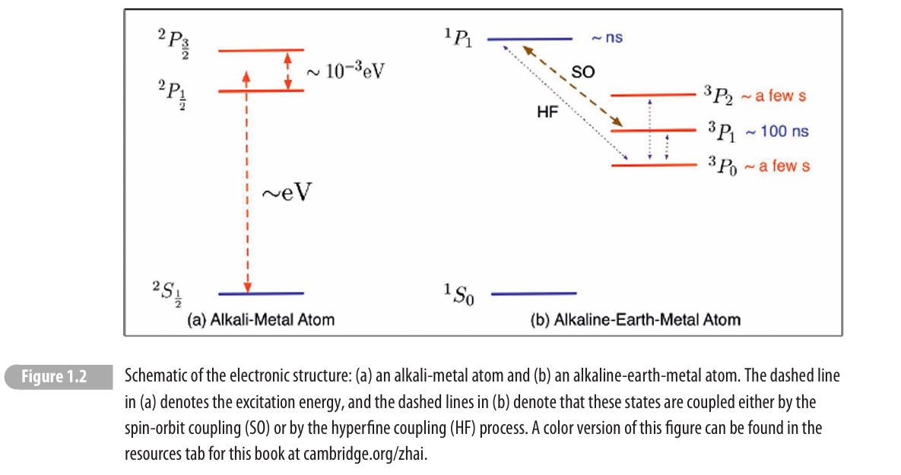
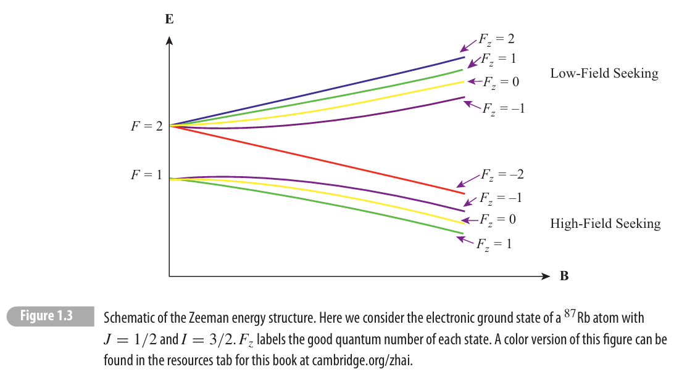
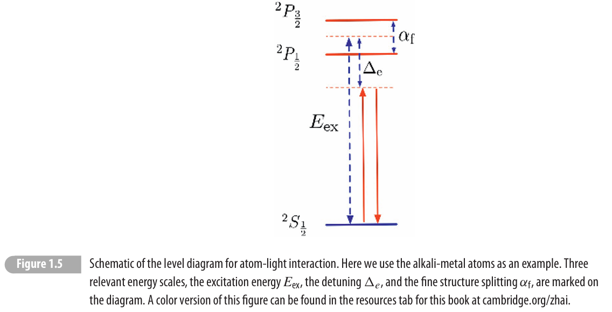

# 1. Electronic Structure

我们先从单个原子的电子结构入手。原子中有一个 separation of energy scales，使得我们能分别处理不同的相互作用。

## Coulomb, fine structure and hyperfine structure

先来看 eV 量级的电子 Coulomb interaction。

单电子在 $\frac{1}{r}$ potential 当中是一个 $\mathrm{SO(4)}$ 对称性，量子数是 $n,\ell ,m$，而能量只和 $n$ 有关。

电子的 screening 把这个对称性破到 $\mathrm{SO(3)}$，不考虑 SOC 的话，$\mathrm{SO(3)}$ 的量子数由 $\ell $ 表示，不同的 $( n,\ell )$ 能量造成分裂。经典图像来看，electronic states with identical $n$ and larger $\ell $ stay farther away from the nucleus. 这就造成 2s 2p 的 splitting。

另一件事，如果两个电子分别在 $\psi _{1} ,\psi _{2}$ 上，那么他的 triplet state 的空间部分波函数是反对称的，这导致两个电子不会出现在同一个地方，从而减小 Coulomb repulsion。在原子当中，这个能量很大，因此推广开来有最大 $S$ 的 Hund's first rule。2nd rule 也来自于 Coulomb 排斥，越大的 $L$ 有利于电子在角方向上错开。

接下来考虑 SOC，他的量级是 meV，约合 $10^{11}$ Hz，一个 eV 大概是 $10^{14}$ Hz。SOC 源自于相对论效应，每个电子都能感受到核绕他旋转 (orbital) 导致的一个有效磁场，产生的类似于 Zeeman effect 这样的东西，因此有
$$
H_{\text{SO}} =\sum\limits _{i} \alpha _{f}^{i}\hat{s}_{i} \cdot \hat{\ell }_{i}
$$
做一个近似，由于 Hund's first rule 更强，所以我们把他近似成
$$
\alpha _{f}\mathbf{L} \cdot \mathbf{S} +( \cdots )
$$
叫他 L-S coupling，在这一项下，$L,S$ 重新变成好量子数，而 $J$ 一直都是 $\mathrm{SO(3)}$ 的好量子数，一个电子态于是可以用 $^{2S+1} L_{J}$ 来表示，这里有 Hund's third rule: 对于小于半充满，$\alpha _{f}  >0$，和单个电子的情况一致，因此取最小的 $J$，大于半充满反之 (particle-hole 变换之后和小于半充满的情况一致，但是轨道角动量会反号，可以这么理解)

:::note
这里注意，一般性的 SOC 来自 Dirac 方程当中得到的 $( \sigma \times p) \cdot \nabla V$ 这种东西，所以在固体当中，他的形式会不一样，$\nabla V$ 对于导带电子可能来自自发电极化，表面或者是外加电场。
:::

最后再次要的效应就是 hyperfine structure 也就是电子和核的 coupling，energy scale is approximately $10^{-6}$ eV。我们在 $J$ 的基础上写出
$$
H_{hf} \simeq \alpha _{hf} \ \mathbf{I} \cdot \mathbf{J}
$$
那么 $L,S,J,I,F,m_{f}$ 是一套新的好量子数。不过原则上 $\mathbf{I}$ interacts differently with orbital and spin, but we just neglect it because the effect is too weak, and this is usually enough.

## Lande projection theorem, g factor

在继续前进之前，我们先来回顾一下 Lande projection theorem。任意一个 rank-1 tensor operator 在 $|Jm_{j} \rangle $ 这个 $( 2J+1)$ manifold 当中的投影都可以这么求：
$$
P_{J}\mathbf{V} P_{J} =C\mathbf{J}
$$
其中 $C$ 这个常数是 dot product 求出来的
$$
C=\frac{\langle \mathbf{J} \cdot \mathbf{V} \rangle }{\mathbf{J}^{2}} =\frac{\langle \mathbf{J} \cdot \mathbf{V} \rangle }{J( J+1)}
$$
因为在 $J$ manifold 当中，所以角动量平方是个数。这可以由 Wigner-Eckart 定理得到：
$$
\langle JM^{\prime } |V_{q} |JM\rangle =\frac{\langle J||V_{q} ||J\rangle }{\sqrt{2J+1}} C_{JM,1q}^{JM^{\prime }}
$$
那么他就正比于同样的 rank-1 tensor operator $\mathbf{J}$，二者成正比，因为前面的矩阵元只和 $J$ 有关，C-G 系数都是一样的。我们之前推导 Stevens operator 也是同样的路数。

因此，对于 $\mathbf{L}$ 和 $\mathbf{S}$，分别有
$$
\begin{aligned}
\langle \mathbf{L} \cdot \mathbf{J} \rangle  & =\frac{1}{2} \langle \mathbf{J}^{2} +\mathbf{L}^{2} -\mathbf{S}^{2} \rangle =\frac{1}{2}( J( J+1) +L( L+1) -S( S+1))\\
\langle \mathbf{S} \cdot \mathbf{J} \rangle  & =\frac{1}{2} \langle \mathbf{J}^{2} -\mathbf{L}^{2} +\mathbf{S}^{2} \rangle =\frac{1}{2}( J( J+1) -L( L+1) +S( S+1))
\end{aligned}
$$
磁矩 $\mathbf{\mu } =-\mu _{B}(\mathbf{L} +2\mathbf{S})$ 在 $|J\rangle $ 的投影就是
$$
\mathbf{\mu } =-\mu _{B}\mathbf{J}\frac{\langle \mathbf{J} \cdot \mathbf{L} \rangle +2\langle \mathbf{J} \cdot \mathbf{S} \rangle }{J( J+1)} =-g_{J} \mu _{B} J
$$
这个系数就是 Lande $g$-factor
$$
g_{J} =1+\frac{1}{2}\frac{J( J+1) -L( L+1) +S( S+1)}{J( J+1)}
$$
之后我们会用到这个结果。

## Electronic Structure of Selected Atoms

接下来我们需要讨论常见的三类原子的光谱。

第一类是碱金属，其电子组态是 $ns^{1}$，因此可以知道三个量子数 $L=0,S=1/2,J=1/2$，记为 $^{2} S_{1/2}$。第一激发态是 $np^{1}$，因此 $L=1,S=1/2$，对应的 $J$ 有两种可能，$J=3/2$ 或者 $J=1/2$，而 $J=3/2$ 的能量高一些。分别记为 $^{2} P_{1/2} ,^{2} P_{3/2}$。历史上，Na 的 $^{1} S\rightarrow ^{2} P$ 的双线分别称为 $D_{1} ,D_{2}$ 线。如果考虑超精细结构的话，比如 $^{87}\text{Rb}$，其核自旋为 $I=3/2$，不考虑 hyperfine splitting，简并度就是 $( 2J+1)( 2I+1) =8$。

:::note
**核物理小课堂**

核模型最简单的是 shell model，可以解释很多东西，原子核内的吸引 potential 可以当成一个带修正的三维谐振子模型来看待，然后在此之上有能级分裂，并且更大的角动量能量更低。并且，核的 nuclear potential 非常陡，因此 SOC 也是 MeV 量级的，综合考虑之后，有这样的 shell model
$$
1s_{1/2}< 1p_{3/2} < 1p_{1/2} < 1d_{5/2} < 2p_{3/2} < 1f_{5/2} < \cdots 
$$
靠这套东西可以解释很多 magic number，还有核的角动量。质子和中子分别填充各自的 shell model，而且他们喜欢填同一个轨道然后 singlet pairing，因为是 strong interaction 导致的吸引。

alkali metal 的质子数是奇数，而且没有什么稳定的 odd-odd 核 (只有 5 种稳定的 odd-odd 核，由于 pairing 很强，even-even 比相同质量数的 odd-odd 稳定很多，一般 odd-odd 都会 $\beta $ 衰变掉。)，所以我们只考虑 odd-even 核，其核自旋由 shell model 里面成单的 particle 或者 hole 决定。偶数个质子或者中子直接两两成对 singlet，从而在核自旋中不起作用。 $^{87}\text{Rb}$ 核自旋为 $I=3/2$，按照 shell model，50 个中子两两配对填满，37 个 proton 其中除了一个 $2p_{3/2}$ 其他都是填满的。和能查到的 shell model diagram 不一样的是，对于 Rb 来说是填 $2p_{3/2}$ 比 $1f_{5/2}$ 能量更低。
:::

第二类是 alkali earth，基态是两个电子配对 $1s^{2}$，$S=0$，记为 $^{1} S_{0}$。激发态为 $ns^{1} np^{1}$，因为 Hund's rule，singlet 态 $^{1} P_{1}$ 能量比较高。而 triplet 态 $S=1$ 分成三条线：$L=1,S=1$ 因此可以有 $J=0,1,2$。对于 even-even 核，$I=0$ 所以没有 hyperfine，对于 even-odd 核，有核自旋从而会有 hyperfine coupling。

各个态的寿命是不一样的，高能级的态会通过自发辐射跳到低能级的态，这源自于原子和电磁波，尤其是电场的相互作用，一阶项是所谓的偶极跃迁，也就是看 $-e\langle f|\mathbf{r} |i\rangle $ 这个矩阵元谁到谁的跃迁是对称性所允许的。

对于 $ ^{1} P_{1} \rightarrow {^{1}S}_{0}$，他的 $\Delta J=1,$ 同时 parity 变了，符合跃迁条件，所以寿命很短，大概在 ns 级别。而 triplet 态 $S=1$，光子不改变 $S$，因此跃迁能级就弱很多。但是考虑 SOC 的其他项之后，$S$ 不再是好量子数，但 $J$ 仍然是，也就是说 triplet 能级中，$J=1$ 的态会混入 $S=0$ 的成分，导致跃迁也是可能的，其寿命大约是 100 ns。

对于其他两个 $J=0,2$ 的态，只有 hyperfine 才会使得他们和 $J=1$ 的态耦合，其寿命大概在 s 的量级，因此可以用来做光钟。记得我们的原子钟是用的 hyperfine 能级之间的跃迁，用的光是在微波的波段，而这里是在用可见光波段。对于 even-even 核，$I=0$，所以 $\mathbf{I} \cdot \mathbf{J}$ 的 hyperfine 就没有，此时两个 $J=0,2$ 的寿命特别长。 

第三种原子是磁性原子，比如说一些稀土，过渡金属。他们一般会有没充满的 $d$ 或 $f$ shell，导致他的 $J$ 会很大，这有几个后果：
- 如果磁化了，他们的电子云是各向异性的，因此 spin-spin interaction 会是各向异性的
- 电子云的 anisotropy 会导致他的 vdW interaction 也是 anisotropic 的
- 磁矩没有极化时，他像一个 $\mathrm{SU(N)}$ model。

# 2. Magnetic Structure

## Zeeman Splitting

我们现在看原子在磁场下是什么情况，我们知道磁场作为 vector potential 附着在 momentum 上面，加上 spin term，就变成
$$
H=\frac{1}{2m}(\mathbf{p} +e\mathbf{A}(\mathbf{r}))^{2} +2\mu _{B}\mathbf{B} \cdot \mathbf{S}
$$
假设均匀磁场 $\mathbf{B} =B\hat{z}$，取对称规范，加上电子的 Zeeman，就约化成：
$$
H=\frac{\mathbf{p}^{2}}{2m} +\frac{\mu _{B}}{\hbar } B( L_{z} +2S_{z}) +\frac{e^{2} B^{2}}{8m}\left( x^{2} +y^{2}\right)
$$
这个抗磁项我们认为在原子中忽略不计，因为我们加的磁场大概不会超过 1 T 量级，抗磁项贡献的能量是 $10^{-10}$ eV，而 hyperfine 这种东西都是 $10^{-6}$ eV 了，因此暂时可以不管，而 Zeeman 项相对来说和 hyperfine 是一个量级。我们加上 hyperfine 还有核的 Zeeman，吸收一下 $\hbar $ 的系数：
$$
H=H_{0} +B( \mu _{B}( L_{z} +2S_{z}) +\mu _{N} g_{I} I_{z}) +\alpha _{\text{hf}}\mathbf{J} \cdot \mathbf{I}
$$
前面两项可以吸收成 $g_{J} J_{z} \mu _{B}$，而且假设磁场没有强到破掉 fine structure 的程度，也就是说 $J$ 还是好量子数，如果要破掉，那么大概需要 10 T 这个量级，所以我们不考虑。

这个图像和量子力学里讲的 fine structure 和 Paschen-Back 的 competition 是一样的，也就是弱场下，不同 $F$ 的能量高低还在，只是 $F_{z}$ 劈裂，强场下，则是由 $S_{z}$ 主导，因为 $\mu _{B} \gg \mu _{N}$。

举个例子 $^{87}\text{Rb}$ 的 $S=1/2,L=0,J=1/2,I=3/2$，有 $F=2,1$ 两个能级，劈裂就变成这个样子。

如果 $| \mathbf{B}| $ 升高能量减小，我们称这个态为 high-field seeking state，因为他会跑到高场去，反之称为 low-field seeking state。我们来看一下 magnetic trapping 这件事，如果我们要一个 $| \mathbf{B}| $ 的 maxima，那么周围的场强都比这个点小，根据连续性，这个点只能是一个 source，因此对磁场是不可能的，因此 high-field seeking state 是不能被 trapped 的。

但是 $| \mathbf{B}| $ 的 local minima 有两种情况，除了 source 以外，还可以是一个马鞍面的形状，也就是所谓的 quadrupole magnetic field
$$
\mathbf{B} =B( x,y,-2z)
$$
他满足 Maxwell 方程。此时我们发现，要把原子聚在一起，我们就需要一个空间有变化的磁场，然后把 hyperfine states 取在一个 low-field seeking state 也就是那些高场下自旋和轨道反平行的态上面。但是也不能让他到那个 $| \mathbf{B}| =0$ 的地方，因为能隙解除了，high-field-seeking can have a transition to low-field-seeking，从而跑走，这也是 magnetic trapping 的难点所在。这个过程叫做 Majorana transition 我们之后讲怎么克服。

## Synthetic Magnetic Field

$\mathbf{B}(\mathbf{r})$ is spatially variant 还有一点就是，某个 hyperfine 态的原子在磁场运动过程中，这个磁场的方向和大小是在变化的。如果 $\nabla B$ 不太大或者能级差不太小，单能级近似成立，从而就会在运动过程中随磁场的变化而积累 Berry phase，这个 Berry phase 可以 map 到一个带电粒子在某个磁场所受的 AB phase 当中，算是一个数学处理。这个数学处理的假场就叫做 synthetic magnetic field，可以做的很大，相当于克服大磁场难以产生这个问题。叫 synthetic，是因为这个磁场是可以人工设计的。在凝聚态中，相似的一个现象叫做 topological Hall effect 和 emergent magnetic field，比起一般的磁场也是很大的。他是电子运动在 real space magnetic texture 当中积累的 Berry phase，同样也是这个 local magnetic field 的变化，典型的例子是 MnSi。我们下面来看数学上怎么处理：

这个做法呢就是在每个 $\mathbf{r}$ 取 local coordinate system, in which 所有的磁场全部朝向 $\hat{z}$ 方向，那么磁场方向的变化带来的 Berry phase 效应就转换到波函数自己的一个随 $\mathbf{r}$ 变化的 gauge field $\mathcal{A}(\mathbf{r})$ 上面。假设：
$$
H_{s}(\mathbf{r}) =\mu _{B} g_{S}\mathbf{B}(\mathbf{r}) \cdot \mathbf{S} +\mu _{N} g_{I}\mathbf{B}(\mathbf{r}) \cdot \mathbf{I} +\alpha _{\text{hf}}\mathbf{J} \cdot \mathbf{I}
$$
可以被一个 operator $\mathcal{U}(\mathbf{r})$ 对角化，且 $\mathcal{U}^{\dagger }(\mathbf{r}) H_{s}(\mathbf{r})\mathcal{U}(\mathbf{r}) =\Lambda (\mathbf{r})$，那么 Schrödinger eq 可以化为
$$
i\hbar \frac{\partial }{\partial t}\left(\mathcal{U}^{\dagger } \psi \right) =-\frac{\hbar ^{2}}{2m}\mathcal{U}^{\dagger } \nabla ^{2}\left(\mathcal{UU}^{\dagger }\right) \psi +\Lambda (\mathbf{r})\mathcal{U}^{\dagger } \psi +i\hbar \left( \partial _{t}\mathcal{U}^{\dagger }\right)\mathcal{U}\left(\mathcal{U}^{\dagger } \psi \right)
$$
后一项不含时，所以扔掉，但是之后会用到。动能项变成
$$
\begin{aligned}
\mathcal{U}^{\dagger } \nabla ^{2}\left(\mathcal{UU}^{\dagger }\right) \psi  & =\mathcal{U}^{\dagger } \nabla \cdot \left( \nabla \mathcal{U}\left(\mathcal{U}^{\dagger } \psi \right) +\mathcal{U} \nabla \left(\mathcal{U}^{\dagger } \psi \right)\right)\\
 & =\mathcal{U}^{\dagger }\left(\mathcal{U} \nabla ^{2} +2\nabla \mathcal{U} +\nabla ^{2}\mathcal{U}\right)\left(\mathcal{U}^{\dagger } \psi \right)\\
 & =\left( \nabla +\mathcal{U}^{\dagger } \nabla \mathcal{U}\right)^{2}\left(\mathcal{U}^{\dagger } \psi \right)
\end{aligned}
$$
设 $\tilde{\psi } =\mathcal{U}^{\dagger } \psi ,\mathcal{A}(\mathbf{r}) =i\hbar \mathcal{U}^{\dagger } \nabla \mathcal{U}$，得到
$$
i\hbar \frac{\partial \tilde{\psi }}{\partial t} =\left(\frac{1}{2m}( -i\hbar \nabla -\mathcal{A}(\mathbf{r}))^{2} +\Lambda (\mathbf{r})\right)\tilde{\psi }
$$
这里的 $\psi $ 是处在 $( 2F+1)$ 维的这个子空间内的，对于 $^{87}\text{Rb}$，gauge field $\mathcal{A}(\mathbf{r})$ 是一个 $8\times 8$ matrix，并且可以证明他是实的，因此原则上他是一个 non-Abelian gauge field。如果没有能级跃迁，也就是 adiabatic，那么就近似成 Abelian gauge field，每个能级受到的是不一样的。从而有 synthetic magnetic field 作用在原子的运动上面
$$
\mathbf{B}_{\text{syn}} =\nabla \times \mathbf{A}_{ii}(\mathbf{r})
$$
其强度其实依赖于实际磁场 $\mathbf{B}$ 方向在空间变化的幅度。

# 3. Light Shift

## Adding light field

我们接下来研究 Light shift 现象，也就是能级在一个可见光的光场当中的 shift，这个 hyperfine 就不要管了，因为无论是光 $\hbar \omega $ 还是 $s\rightarrow p$ 的激发能量 $E_{ex}$ 都是 eV 这个量级，顶多是考虑 SOC 也就是 $\mathbf{L} \cdot \mathbf{S}$，我们定义 $E_{ex}$ 为 $^{2} S$ 和 $^{2} P$ 的能量差，取两个 fine structure 的中间。并且只考虑两根能级，激发能量和光子能量 $\hbar \omega $ 的差称为 detuning，然后也不考虑磁场（不过激光就需要考虑，后面会讲为什么，在这里长波近似下面，E1 就是比其他要大）

这里的物理就是，原子和光场耦合，如果能量对上了，是两个态之间的跃迁，如果能量对不上，则只是一个基态的修正。能级图如图所示：

原子的 Hamiltonian 投影到这个子空间，就可以近似写成
$$
H_{\text{atom}} =E_{ex} P_{e} +\alpha \mathbf{S} \cdot \mathbf{L}
$$
在一个含时的电磁场 $\mathbf{A}( t)$ 下，有 minimal coupling
$$
H=\frac{1}{2m}\sum\limits _{i}(\mathbf{p}_{i} +e\mathbf{A}( t))^{2} +\cdots 
$$
然后这个 $\mathbf{A}( t)$ 可以用一个规范变换变成 $\mathbf{E} \cdot \mathbf{d}$ 形式，记得随便一个 unitary operator 有
$$
\mathcal{U}^{\dagger }\mathbf{p}^{2}\mathcal{U} =\left(\mathbf{p} -i\hbar \mathcal{U}^{\dagger } \nabla \mathcal{U}\right)^{2}
$$
那么取 $\mathcal{U} =\mathrm{e}^{-ie\sum\nolimits _{i}\mathbf{A}( t) \cdot \mathbf{r}_{i} /\hbar }$，可以得到 $\mathcal{U}\mathbf{p}^{2}\mathcal{U}^{\dagger } =(\mathbf{p} +e\mathbf{A})^{2}$， $\mathcal{U}^{\dagger } H\mathcal{U}$ 就变成普通的动能形式，但是方程多出来一项含时演化
$$
i\hbar \frac{\partial }{\partial t}\tilde{\psi } =\sum\limits _{i}\left(\frac{\mathbf{p}_{i}^{2}}{2m} +V(\mathbf{r}_{i})\right)\tilde{\psi } +i\hbar \left( \partial _{t}\mathcal{U}^{\dagger }\right)\mathcal{U}\tilde{\psi } =\sum\limits _{i}\left(\frac{\mathbf{p}_{i}^{2}}{2m} +V(\mathbf{r}_{i}) -e\mathbf{r}_{i} \cdot \frac{\partial \mathbf{A}}{\partial t}\right)\tilde{\psi }
$$
最后是变成一个这样的 Hamiltonian，这里还没有投影到有效子空间：
$$
H_{\text{atom}} =H_{0} -\mathbf{E}( t) \cdot \mathbf{d}
$$
其中 $\mathbf{d} =-e\sum\nolimits _{i}\mathbf{r}_{i}$ 是偶极算符。取单色光 $\mathbf{E}( t) =E_{j}^{0}\cos( \phi _{j} -\omega t)$，这里包含了偏振和强度信息。

## Rotating Wave Approximation

为了求解这个新的 Hamiltonian
$$
H=H_{0} -\sum\limits _{j} E_{j}^{0} d_{j}\cos( \phi _{j} -\omega t)
$$
我们引入旋转波近似，也就是再对 $H$ 做一个 $\mathcal{U}( t) =\mathrm{e}^{-i\omega tP_{e}} =P_{g} +P_{e}\mathrm{e}^{-i\omega t}$ 这个 unitary transform，那么
$$
\begin{aligned}
\mathcal{U}^{\dagger } H_{d}\mathcal{U} & =\left( P_{g} +P_{e}\mathrm{e}^{+i\omega t}\right)\left(\sum\limits _{j} E_{j}^{0} d_{j}\cos( \phi _{j} -\omega t)\right)\left( P_{g} +P_{e}\mathrm{e}^{-i\omega t}\right)\\
 & =\sum\limits _{j}\frac{E_{j}^{0}}{2}\left(\mathrm{e}^{i( \phi _{j} -\omega t)} +\mathrm{e}^{-i( \phi _{j} -\omega t)}\right)\left( P_{g} +P_{e}\mathrm{e}^{+i\omega t}\right) d_{j}\left( P_{g} +P_{e}\mathrm{e}^{-i\omega t}\right)\\
 & =\sum\limits _{j}\frac{E_{j}^{0}}{2}\left(\mathrm{e}^{i( \phi _{j} -\omega t)} +\mathrm{e}^{-i( \phi _{j} -\omega t)}\right)\left( P_{g} d_{j} P_{e}\mathrm{e}^{-i\omega t} +P_{e} d_{j} P_{g}\mathrm{e}^{+i\omega t}\right)
\end{aligned}
$$
我们把含有 $\mathrm{e}^{2i\omega t}$ 的东西扔掉，这就是旋转波近似，这是因为 $\omega \simeq E_{ex}$，所以在这个简谐微扰的二能级系统里面，$\omega +E_{ex}$ 分母的那项就可以忽略，对应于基态放出光子并且到达激发态这个能量更不守恒的过程。所以我们先对整个微扰 Hamiltonian $H_{d}$ 做一个规范变换 $\mathrm{e}^{i\omega tP_{e}} H_{d}\mathrm{e}^{-i\omega tP_{e}}$，这样原来 $\mathrm{e}^{-i\omega t}$ 的项就变得不旋转，而 $\mathrm{e}^{+i\omega t}$ 就转的更快，从而可以分离出来扔掉，方便处理。

最后得到
$$
\mathcal{U}^{\dagger } H_{d}\mathcal{U} =\sum\limits _{j}\frac{E_{j}^{0}}{2}\left(\mathrm{e}^{i\phi _{j}} P_{e} d_{j} P_{g} +\mathrm{e}^{-i\phi _{j}} P_{g} d_{j} P_{e}\right)
$$
定义复振幅 $\mathcal{E}_{j} =E_{j}^{0}\mathrm{e}^{i\phi _{j}}$。我们还知道做了这个之后，哈密顿量还会多一项
$$
i\hbar \left( \partial _{t}\mathcal{U}^{\dagger }\right)\mathcal{U} =-\hbar \omega 
$$
那么最后就约化到
$$
H=\Delta P_{e} +\alpha \mathbf{S} \cdot \mathbf{L} +\frac{1}{2}\sum\limits _{j}\left(\mathcal{E}_{j} P_{e} d_{j} P_{g} +\mathcal{E}_{j}^{*} P_{g} d_{j} P_{e}\right)
$$
之后会讲 Floquet theory，就会考虑我们忽略的高阶过程。

:::note
**复振幅**
实际上光学里面已经学过了，我们假设传播方向沿 $+z$ 轴，那么如果两个相位相同或相反，是线偏振光，圆偏振光则是 $E_{x}^{0} =E_{y}^{0}$，并且 $\phi _{y} =\phi _{x} +\frac{\pi }{2}$，也就是 $\mathcal{E}_{y}^{0} =i\mathcal{E}_{x}^{0}$ 是 L 光，$\mathcal{E}_{y}^{0} =-i\mathcal{E}_{x}^{0}$ 是 R 光，对应的 $\hat{e}_{\pm } =\mp \frac{1}{\sqrt{2}}(\hat{x} -i\hat{y})$。其他情况则都是椭圆偏振。
:::

下来我们来求解这个变换后的 Hamiltonian，注意 $H_{\text{atom}}$ 在这个变换下面是不变的。运用陈童量子力学当中的 effective Hamiltonian 求在基态子空间当中的
$$
H_{\mathrm{eff}}( z=0) =\frac{1}{4}\sum\limits _{ij}\mathcal{E}_{i}^{*} P_{g} d_{i} P_{e}\frac{1}{0-\Delta _{e}} P_{e} d_{j} P_{g}\mathcal{E}_{j}
$$
定义一个和光场无关的张量
$$
\hat{\mathcal{D}}_{ij} =P_{g} d_{i} d_{j} P_{g}\frac{1}{\Delta _{e}}
$$
那么 effective Hamiltonian is derived as
$$
H_{\mathrm{eff}} =-\frac{1}{4}\mathcal{E}_{i}^{*}\hat{\mathcal{D}}_{ij}\mathcal{E}_{j}
$$

## Scalar Light Shift

对于没有自旋轨道耦合，就是 $L=0$ 的情况，由于旋转对称性 $\hat{\mathcal{D}}_{ij} =-4\delta _{ij} u_{s}$，这里
$$
u_{s} =-\frac{e^{2}}{12\Delta _{e}} \langle g|r^{2} |g\rangle 
$$
此时 effective Hamiltonian 就和光的强度有关：
$$
H_{\mathrm{eff}} =u_{s}| \mathcal{E}| ^{2}
$$
注意 $u_{s}$ 和 $\Delta _{e}$ 的符号有关。对于不同的自旋，这个 Hamiltonian 的作用是一样的，并且和光的偏振无关，所以叫做 scalar light shift。

对于 red detuning case，$\Delta _{e}  >0$，也就是 $u_{s} < 0$，那么光越强这个 scalar shift 越负，原子就喜欢呆在光的 local maximum 的地方，这就是 laser trapping 或者 optical tweezer 的原理。此时 spin 仍然是 degenerate 的，可以使用。不过有一点是这个处理没有包含自发辐射 (参见 Griffiths 的讨论，自发辐射在非量子化的光场下只能通过 Einstein 关系去间接估计) 在这里我们把自发辐射处理成激发态的寿命，那么：
$$
u_{s} \varpropto \frac{1}{\Delta _{e} -i\Gamma }
$$
因此为了得到这个物理，也就是让 $u_{s}$ 的实部主导，我们需要 $\Delta _{e} \gg \Gamma $，也就是这个能级的 detuning 要大于线宽，也就是不能让他真的进共振，否则就真的是 Rabi physics 了。同时 $E_{ex} \gg \Delta _{e}$。

还有一个应用是打两束相对的光，假设他们都是 $y$-polarized 那么这个 potential 就变成：
$$
\mathcal{E}_{y} =2E^{0}\cos( kx)
$$
有一个周期性，这就是 optical lattice。

我们还可以在 $\Delta _{e} \gtrsim \Gamma $ 的情形实现 laser cooling。自发辐射出的光子平均动量是消掉的，所以在一束光里的原子就会平均感受到一个和光子动量方向 $\mathbf{k}$ 相反的一个回弹，正比于 $\Gamma /\Delta _{e}^{2}$ 和光子动量 $k$。那么在两束相对的光里面，运动的原子就会慢慢减速，达到降温的效果。不过光用 laser cooling 不太能达到量子简并，一般还要用 evaporative cooling。

## Vector Light Shift

如果考虑 SOC，那么 $( z-H_{\mathrm{eff}})^{-1}$ 变成
$$
( \Delta _{e} +\alpha \mathbf{S} \cdot \mathbf{L})^{-1} \approx \frac{1}{\Delta _{e}} -\frac{\alpha }{\Delta _{e}^{2}}\mathbf{S} \cdot \mathbf{L}
$$
因此除了 scalar shift，还会有一个
$$
\hat{\mathcal{D}}_{ij} =P_{g} d_{i}\frac{1}{\Delta _{e}} d_{j} P_{g} -\frac{\alpha }{\Delta _{e}^{2}} P_{g} d_{i}(\mathbf{S} \cdot \mathbf{L}) d_{j} P_{g}
$$
这个慢慢算，由于碱金属基态没有 SOC 最后结果是：
$$
\hat{\mathcal{D}}_{ij} \simeq -4u_{s}\left( \delta _{ij} +i\frac{\hbar \alpha _{f}}{\Delta _{e}} \epsilon _{ijl} S_{l}\right)
$$
也就是说
$$
H_{\mathrm{eff}} =u_{s}| \mathcal{E}| ^{2} +iu_{v}\left(\mathcal{E}^{*} \times \mathcal{E}\right) \cdot \mathbf{S}
$$
这里 $u_{v} =\hbar \alpha /\Delta _{e}$ 是 vector polarizability，最后效果是在光场里面有一个有效的 Zeeman field $iu_{v}\left(\mathcal{E}^{*} \times \mathcal{E}\right)$。这个可以理解，因为如果没有 SOC，那么光场只是和轨道电荷有作用，自旋没有。对于碱金属，这个效应是比较小的，正比于 $\Delta _{e}^{-2}$，和自发辐射是同一量级，所以不能 suppress 自发辐射 by 调控这个 vector shift 的强度，这是因为碱金属只有激发态有 SOC。不过对于稀土，SOC 在基态就有，就是可以调控的了。

这个等效的 Zeeman 的条件是 TRS 破缺，这可以通过加上一 circular polarized light 来实现，此时假设
$$
\mathcal{E} =\frac{E_{0}}{\sqrt{2}}(\hat{x} -i\hat{y})
$$
那么
$$
\mathbf{B}_{\mathrm{eff}} =-u_{v} E_{0}^{2}\hat{z}
$$
因为固定观察方向时，TRS 会把左旋光变成右旋光，所以此时 TRS 是没有的，不过这个变换不改变光子的 helicity，因为传播方向同时也会改变。

## Synthetic SOC

这个 effective Zeeman field 的还有一个作用是所谓的 synthetic SOC，也就是说对于 $\mathbf{S}$ 的作用可以投影到原子的总自旋 $\mathbf{F}$ 上面，从而在适当的激光里可以做出一个 k-dependent magnetic field，也就是人造 SOC。我们取两束极化方向不同的光，频率不同但是在 $x$ 方向互相打
$$
\mathbf{E} =E_{1}\mathrm{e}^{ik_{0} x+i\omega _{1} t}\hat{y} +E_{2}\mathrm{e}^{-ik_{0} x+i\omega _{2} t}\hat{z}
$$
那么
$$
H_{\mathrm{eff}} =iu_{v} E_{1} E_{2}\left(\mathrm{e}^{-i2k_{0} x-i\delta \omega t} +\mathrm{e}^{i2k_{0} x+i\delta \omega t}\right) S_{x}
$$
用上面的投影定理弄到 $F$ 上面，加一个 Zeeman field
$$
H_{s} =hF_{z} +i\Omega \left(\mathrm{e}^{-i2k_{0} x-i\delta \omega t} +\mathrm{e}^{i2k_{0} x+i\delta \omega t}\right) F_{x}
$$
做一个旋转波近似，$\mathcal{U} =\mathrm{e}^{-i\delta \omega tF_{z} /\hbar }$，然后 $\mathcal{U}^{\dagger } H_{s}\mathcal{U}$ 再加一项时间导数，变成
$$
H_{s} =( h-\delta \omega ) F_{z} +\Omega (\sin( 2k_{0} x) F_{x} -\cos( 2k_{0} x) F_{y})
$$
这个是个空间依赖的磁场，把他转到 $z$ 方向：apply $\mathcal{U} =\mathrm{e}^{-i2k_{0} xF_{z}}$ 同时动能出现一个规范场
$$
H=\frac{\hbar ^{2}}{2m}( k_{x} -2k_{0} F_{z} /\hbar )^{2} +\frac{\hbar ^{2}\mathbf{k}_{\perp }^{2}}{2m} +( h-\delta \omega ) F_{z} -\Omega F_{y}
$$
打开以后写成
$$
H=\frac{\mathbf{k}^{2}}{2m} +h(\mathbf{k}) \cdot \mathbf{F}
$$
这个 SOC 场就是
$$
h(\mathbf{k}) =\left( 0,-\Omega ,h-\delta \omega -\frac{2\hbar }{m} k_{0} k_{x}\right)
$$
如果 $\Omega $ 特别小，那么 $k_{x}$ 的最低点依赖于 $\Omega $，按 $\Omega $ 随时间或者空间的变化可能给出 emergent magnetic / electric field，但是只依赖于光的 profile 而不会动。

# Stimulated Raman Adiabatic Passage

## What is Raman

我们先来讲讲什么是 Raman，Raman 散射本质上是光和物质发生非弹性散射：

入射一个光子 $\hbar\omega_i$，散射出来的光子频率变成 $\omega_s\neq\omega_i$，两者的能量差被物质内部的某个 excitation 吸收或释放：

$\hbar\omega_i-\hbar\omega_s=\Delta E$。

这个 $\Delta E$ 可以对应 phonon, magnon 等等，包括分子振动的 phonon，所以 Raman spectroscopy 实际上是在用光测材料内部的低能激发谱。

最简单的图像是：

- Rayleigh scattering：$\omega_s=\omega_i$，弹性散射。
- Stokes Raman：$\omega_s<\omega_i$，光子把一部分能量留给材料，$\hbar\omega_s=\hbar\omega_i-\Delta E$。
- anti-Stokes Raman：$\omega_s>\omega_i$，材料原本已经有一个激发，把能量给光子，$\hbar\omega_s=\hbar\omega_i+\Delta E$。

其中 anti-Stokes 的强度要比 Stokes 低一些，毕竟体系内本来有的激发在 Boltzmann 分布下概率比较小

矩阵元比较容易推导，含时微扰论的二阶展开就行了：

$$
\mathcal{M}_{fi} =\sum _{n}\left[\frac{\langle f|\mathbf{d} \cdot \boldsymbol{\epsilon }_{s}^{*} |n\rangle \langle n|\mathbf{d} \cdot \boldsymbol{\epsilon }_{i} |i\rangle }{E_{i} +\hbar \omega _{i} -E_{n} +i\Gamma _{n}} +\frac{\langle f|\mathbf{d} \cdot \boldsymbol{\epsilon }_{i} |n\rangle \langle n|\mathbf{d} \cdot \boldsymbol{\epsilon }_{s}^{*} |i\rangle }{E_{i} -\hbar \omega _{s} -E_{n} +i\Gamma _{n}}\right]
$$

其中第二项是先发射再吸收的一个虚过程，对于基态来说振幅比较小，在 RWA 近似下通常忽略。不过对于激发态开始的 Raman，或者非共振 Raman，这二者都要考虑。

## How to do

我们立刻发现我们要做的这个东西本质上也是 Raman，就是通过一个二阶光子过程把基态转移到激发态。如果用绝热演化的方式进行，困难在于那个 gap 不一定很大。所以改用一个 pump laser 和一个 stoke laser 去把他跳一下，假设二者能量是 $\omega_p, \omega_s$，耦合常数是含时的 $\Omega_p (t), \Omega_s (t)$，再引入两个 detuning，STIRAP 要求他们相等也就是初末态能量守恒。

> 更新中，快学完了