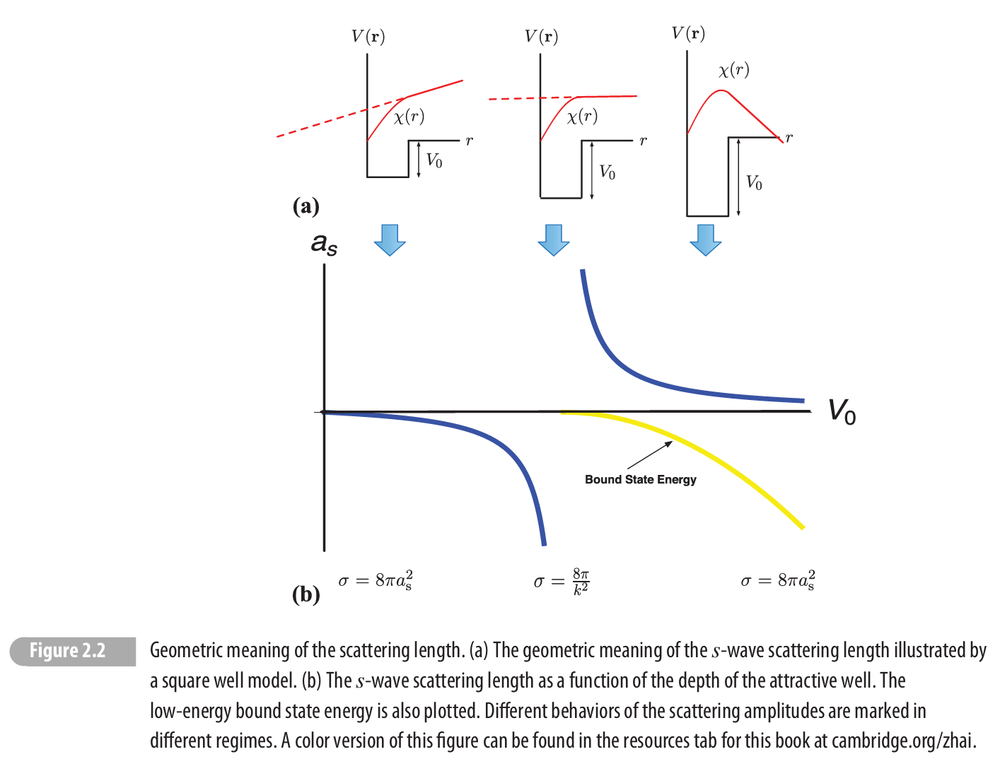

# Scattering Length

## 相移
我们先来研究冷原子体系的 two-body interaction，有三个特点：
- short ranged: 我们总是可以设置一个 range，使得：$V( r >r_{0}) =0$
- dilute: 大部分时间，原子间距 $d\gg r_{0}$，由于量子性，de Broglie 波长 $k\sim 1/d$，因此有动能远小于 $r_{0}$ 定义的能量量纲，或者直接写 $k\ll \frac{1}{r_{0}}$
- low energy: 冷原子的动能远小于 attractive potential 的强度 $\mathcal{E}_{k} \ll V_{0}$

假设我们先考虑 isotropic interaction，对于散射态，我们想解 Schrödinger 方程以获得散射定态的知识：
$$
\left[ -\frac{\hbar ^{2}}{2\overline{m}} \nabla ^{2} +V( r)\right] \psi (\mathbf{r}) =E\psi (\mathbf{r})
$$
其中 $\overline{m}$ 是约化质量。由于 potential 是球对称的，我们可以把 $\psi (\mathbf{r})$ 分解成 partial wave:
$$
\psi (\mathbf{r}) =\sum\limits _{l} A_{l}\frac{\chi _{kl}( r)}{kr} P_{l}(\cos \theta )
$$
代入以后得到径向方程：
$$
\frac{\mathrm{d}^{2} \chi _{kl}( r)}{\mathrm{d} r^{2}} -\frac{l( l+1)}{r^{2}} \chi _{kl} +\frac{2\overline{m}}{\hbar ^{2}}( E-V(\mathbf{r})) \chi _{kl} =0
$$
我们把 $E >0$ reparametrilize 成 $E=\hbar ^{2} k^{2} /2m$。并且暂且只考虑 $l=0$ 的 channel，于是
$$
\frac{\mathrm{d}^{2} \chi _{kl}( r)}{\mathrm{d} r^{2}} +\frac{2\overline{m}}{\hbar ^{2}}( E-V(\mathbf{r})) \chi _{kl} =0
$$
对于 $r >r_{0}$，他是一个平面波
$$
\chi _{kl} \varpropto \sin( kr+\delta _{k})
$$
这个 phase shift $\delta _{k}$ 就表示了 s-wave 散射的低能信息，由于增加 $\pi $ 只是一个负号，不改变 quantum state，因此我们可以把他限制在 $( -\pi /2,\pi /2)$ 这个 branch 里面。

可以通过内部和外部的连接条件来确定 $\delta _{k}$，也就是
$$
\frac{\chi ^{\prime }( r< r_{0})}{\chi ( r< r_{0})}\Bigl|_{r_{0}} =\frac{k}{\tan( kr_{0} +\delta _{k})} \approx \frac{k}{\tan \delta _{k}}
$$
其中 RHS 就是正弦波求导以后的结果，在 $kr_{0} \ll 1$ 做的近似。对于 hard sphere potential，导数不连续，则有:
$$
\chi ( r_{0}) =0\Longrightarrow \delta _{k} =-kr_{0}
$$
对于其他的 $l$，有 $\delta _{l} \sim ( kr_{0})^{2l+1}$，因此在 $kr_{0} \ll 1$ 的情况下可以 legally ignore $l >0$。

## 一般散射理论

对于固定 potential 的散射，我们可以认为初态和末态都是没有相互作用的哈密顿量 $H_{0}$ 的本征态，记为 $|\alpha \rangle ,|\beta \rangle $。其概率幅可以用 interaction picture 的时间演化算符 $U( +\infty ,-\infty ) =S$ 来表示，
$$
\langle \beta |S|\alpha \rangle =S_{\beta \alpha }
$$
$S_{\beta \alpha }$ 记为 $S$ 矩阵。含时微扰求和到无穷阶可以得到：
$$
\langle \beta |S|\alpha \rangle =\delta ( \beta -\alpha ) -2\pi i\delta ( E_{\beta } -E_{\alpha }) \langle \beta |T|\alpha \rangle 
$$
其中 $T$ 矩阵
$$
T=V+VG\left( E_{\alpha }^{+}\right) V+\cdots \ 
$$
而跃迁概率 ($\alpha \neq \beta $)，此处 $G\left( E_{\alpha }^{+}\right) =1/( E_{\alpha } +i\eta -H_{0})$
$$
w_{\alpha \rightarrow \beta } =\frac{2\pi }{\hbar }| \langle \beta |T|\alpha \rangle | ^{2} \delta ( E_{\beta } -E_{\alpha })
$$
同时可以定义微分散射截面等等。

$T$ 矩阵本身是非微扰的，可以从 $H$ 直接求解出的散射定态来得到，我们定义
$$
|\psi _{\alpha }^{+} \rangle =U( 0,-\infty ) |\alpha \rangle 
$$
我们可以计算：
$$
|\psi _{\alpha }^{+} \rangle =|\alpha \rangle +G\left( E_{\alpha }^{+}\right) T|\alpha \rangle 
$$
而且可以证明 $T|\alpha \rangle =V|\psi _{\alpha }^{+} \rangle $，因此得到 Lippman-Schwinger 方程
$$
|\psi _{\alpha }^{+} \rangle =|\alpha \rangle +G\left( E_{\alpha }^{+}\right) V|\psi _{\alpha }^{+} \rangle 
$$
并且有：
$$
( E_{\alpha } -H_{0}) |\psi _{\alpha }^{+} \rangle =V|\psi _{\alpha }^{+} \rangle 
$$
也就是 $|\psi _{\alpha }^{+} \rangle $ 是 $H$ 的能量为 $E_{\alpha }$ 的本征态。于是如果能直接解出 $E >0$ 的本征态，就可以借此得到散射的信息。

对于球对称 potential，由于入射的平面波包含了各种 $l$ 的分量，他们被散射的效果是不一样的，所以在无穷远处，散射定态可以写成这样的形式：
$$
\psi ( E >0) \sim \mathrm{e}^{ik_{R} z} +f( \theta ,\phi )\frac{\mathrm{e}^{ik_{E} r}}{r}
$$
而散射截面可以证明是
$$
\frac{\mathrm{d} \sigma }{\mathrm{d} \Omega }( \theta ,\phi ) =| f( \theta ,\phi )| ^{2}
$$
对于球对称 potential，$S,T$ 矩阵是一个 $l,E$ 的对角矩阵。并且 $S$ 矩阵可以写成相移形式：
$$
S_{l}( E) =\mathrm{e}^{i2\delta _{l}( E)} =1-2\pi iT_{l}( E)
$$
可以证明
$$
f( \theta ,\phi ) =\frac{1}{k_{E}}\sum\limits _{l}( 2l+1)\mathrm{e}^{i\delta _{l}( E)}\sin \delta _{l}( E) P_{l}(\cos \theta )
$$
因此总散射截面：
$$
\sigma _{T} =\frac{4\pi }{k_{E}^{2}}\sum\limits _{l}( 2l+1)\sin^{2} \delta _{l}
$$

## 散射长度
我们之前得到了：
$$
\frac{\chi ^{\prime }( r< r_{0})}{\chi ( r< r_{0})}\Bigl|_{r_{0}} \approx \frac{k}{\tan \delta _{k}}
$$
对于能量很低的散射 $E\ll V_{0}$，左边可以认为近似和 $E$ 或者 $k$ 无关，记作一个数 $-\frac{1}{a_{s}}$，称为散射长度。其可视为波函数的节点，因为
$$
\chi \varpropto \sin( kr+\delta _{k}) \approx \sin \delta _{k} +( kr)\cos \delta _{k} \varpropto 1-\frac{r}{a_{s}}
$$
 $a_{s}$ 描述了 $k$ 和 $\delta _{k}$ 的关系，从而一个参数 $a_{s}$ 就基本可以描述所有 $\delta _{k}$：
$$
\delta _{k} =-\arctan( ka_{s})
$$
对于 $a_{s}  >0$，$k$ 很小的时候，$\delta _{k} \varpropto k$，斜率是 $-a_{s}$，$k$ 增大时趋近 $-\pi /2$。$a_{s} < 0$ 则是整的斜率，$\delta _{k}  >0$。$| a_{s}| $ 越大，趋近 $-\pi /2$ 的速度就越快。

对于一个 $r< a$ 的 uniform finite well，可以求得：
$$
a_{s} =a-\frac{\tan( k_{0} a)}{k_{0}}
$$
其中：$V_{0} =\hbar ^{2} k_{0}^{2} /2m$。$V_{0}$ 比较小的时候，$a_{s} < 0$ 代表吸引相互作用，而 $a_{s}  >0$ 代表有效的排斥相互作用。注意这个是在 $ka_{s} \ll 1$ 或者 $a_{s} \ll $粒子间距 $d$ 的时候才是正确的。在这个区间内，
$$
f_{s} =\frac{1}{a_{s}^{-1} -ik}
$$
因此:
$$
\sigma _{T} =\frac{1}{a_{s}^{-2} +k^{2}}
$$
当 $a_{s} k\ll 1$ 时，散射截面正比于 $a_{s}^{2}$，就是说散射长度越大，散射截面越大。但是 $a_{s} k\gg 1$ 时，就是发散共振的情况，此时 $\sigma _{T} \varpropto k^{-2}$

随着 $V_{0}$ 增大，大到 $k_{0} a=\pi $ 的时候，$a_{s}$ 发散，此时会发生这个事情，就是一个低能束缚态的出现，对于束缚态
$$
E=-\frac{\hbar ^{2} \kappa ^{2}}{2\overline{m}} < 0,\kappa  >0
$$
我们解方程到最后仍会得到：
$$
\frac{\chi ^{\prime }( r< r_{0})}{\chi ( r< r_{0})}\Bigl|_{r_{0}} =-\kappa 
$$
而左边仍然是 $-a_{s}^{-1}$，右边是 $\mathrm{e}^{-\kappa r}$ 求导求出来的解。这就说明，当 $a_{s}  >0$ 时，有解，当 $a_{s} < 0$ 时，无解。也就是说在 $a_{s}  >0$ 时，有一个能量是
$$
E=-\frac{\hbar ^{2} \kappa ^{2}}{2\overline{m}} =-\frac{\hbar ^{2}}{2\overline{m} a_{s}^{2}}
$$
的 shallow bound state。当然这只是在共振区域前后才是如此，如果 $V_{0}$ 继续增大，这个 bound state 会逐渐下沉，导致无法再被这种方法描述。这个点就叫做散射共振点，此处，$\delta _{k}$ jump by $\pi $，shallow bound state 和 $a_{s}$ 发散几个事情同时出现。但是在共振附近不能说 $a_{s}$ 越大 $\sigma $ 越大，也不能说有效的排斥和吸引作用和 $a_{s}$ 的正负号有关。

同时我们看到不同 $V_{0}$ 的 $a_{s}$ 可能是一样的，这就是低能散射近似底下的一种 universality。

## 高阶效应
在 $a_{s} =\infty $ 这个点，LHS 没有对 $k$ 的零阶响应，但是可以有高阶的响应：
$$
\frac{k}{\tan \delta _{k}} \simeq -\frac{1}{a_{s}} +\frac{1}{2} r_{\mathrm{eff}} k^{2}
$$
在 $a_{s} =0$ 这个点，$a_{s}^{-1}$ 发散，所以我们倒着展开：
$$
\frac{\tan \delta _{k}}{k} \approx -a_{s} +\frac{1}{2} v_{\mathrm{eff}} k^{2}
$$
此时 $\tan \delta _{k} \varpropto k^{3}$。

# 有效相互作用

## Fermi pseudopotential

我们已经知道有 universality 了，那么我们预想的是，在这个能标下的相互作用可以写成只和唯一的参数 $a_{s}$ 有关的形式，并且足够简单。最简单的是 contact potential
$$
V( r) =g\delta ( r)
$$
然而，在低能下，
$$
\chi ( r) \sim 1-\frac{r}{a}
$$
因此
$$
\psi ( r) \varpropto \frac{\chi ( r)}{r} =\frac{1}{r} -\frac{1}{a}
$$
本来就在 $r=0$ 发散。再乘以一个发散的 $\delta ( r)$ 就会在 $r\rightarrow 0$ 出问题，因此 Fermi 的做法是加上一个 $\partial _{r} r$，所以
$$
\partial _{r} r\left(\frac{1}{r} -\frac{1}{a}\right) =-\frac{1}{a}
$$
那么，假设这个相互作用为 $g$，$\chi ( r)$ 应该是他的本征态，因此左边
$$
-\frac{\hbar ^{2}}{2m} \nabla ^{2}\left(\frac{1}{r} -\frac{1}{a}\right) +g\delta ( r) \partial _{r} r\left(\frac{1}{r} -\frac{1}{a}\right)
$$
为了让奇异性抵消，就需要
$$
g=\frac{2\pi \hbar ^{2} a_{s}}{m}
$$
因此 pseudopotential 的形式就是：
$$
V( r) =\frac{2\pi \hbar ^{2} a_{s}}{m} \delta ( r) \partial _{r} r
$$

## Renormalization

还有一种思路是把 $g\delta ( r)$ 视为一个低能的有效相互作用，从而通过 RG 的方式把设定的 $g$ 的高能细节给积掉，到最后和物理现实 $a_{s}$ 联系起来。具体可以这么操作，就是计算这个 $\delta ( r)$ 相互作用的 $T$ 矩阵，我们知道：
$$
T( E) =\frac{V}{1-G\left( E^{+}\right) V} =\frac{1}{\frac{1}{g} -\int _{\mathbf{p}}^{p< \Lambda }\frac{1}{E+i\eta -p^{2} /2\overline{m}}}
$$
这里我们人为引入一个高能 cut-off，从而抵消发散。用 $k\ll \Lambda $ 的近似得到
$$
T( E) =\frac{1}{\frac{1}{g} +\frac{m\Lambda }{\pi } +i\frac{mk}{2\pi }}
$$
而
$$
T( E) =-\frac{2\pi }{\overline{m}} f( k) =\frac{1}{\frac{m}{2\pi a_{s}} +i\frac{mk}{2\pi }}
$$
因此得到模型参数和物理量 $a_{s}$ 的关系：
$$
\frac{1}{g} +\frac{m\Lambda }{\pi } =\frac{m}{2\pi a_{s}}
$$
当然也可以用维度正规化做。

## Renormalization Group

我们已经知道了如下关系：
$$
\frac{1}{g( \Lambda )} =\frac{m}{2\pi a_{s}} -\frac{m\Lambda }{\pi }
$$
我们想要知道当改变 $\Lambda $ 时，$g$ 是如何变化的，这就是 RG。定义无量纲相互作用参数
$$
\tilde{g} =\frac{m\Lambda }{\pi } g
$$
可以得到：
$$
\Lambda \frac{\mathrm{d}\tilde{g}}{\mathrm{d} \Lambda } =\tilde{g} +\tilde{g}^{2}
$$
两个 fixed point，$\tilde{g} =0$ 代表 $a_{s}\rightarrow 0$，也就是没有相互作用。$\tilde{g} =-1$ 代表 $a_{s}\rightarrow \infty $，也就是散射共振。在 $\tilde{g} =0$ 附近，这里换成 $g$ 简写：
$$
\Lambda \frac{\mathrm{d} \delta g}{\mathrm{d} \Lambda } =\delta g( 1+2g) \approx \delta g
$$
因此：
$$
\frac{\mathrm{d}\ln g}{\mathrm{d}\ln \Lambda } =1
$$
随着 $\Lambda \rightarrow 0$，$g\rightarrow 0$，因此在低能下是稳定的，而在 $g=-1$ 附近，
$$
\Lambda \frac{\mathrm{d} \delta g}{\mathrm{d} \Lambda } =-\delta g
$$
因此随着 $\Lambda \rightarrow 0$，$g$ 远离 $g^{*} =-1$，因此在低能下是不稳定的，这个点对应一个 critical point。对于费米子，在 $g< -1$，$a_{s} < 0$，没有 shallow 束缚态，但是 fermion 配对形成 BCS。而在 $g  >-1$，$a_{s}  >0$，形成分子，有 BEC。这是 BEC-BCS crossover 的一个基本物理，之后还会讲。