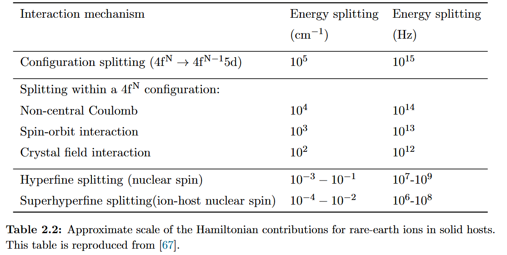

# Rare-earth 4f electrons as a quantum memory

## 4f electrons

Quantum memory 自然是存量子态的，我们限定于 solid-state rare-earth as an optical quantum memory。优点是好调，且容易和其他 cavities 之类的拼接。缺点是
- environment of atoms are different, causing inhomogeneous broadening
- coherence time is shorten b/c of coupling to the environemnt

稀土的 4f 电子态相对隔离，谱线窄寿命长，所以可以用作 quantum mem.

固体中 4f 电子的能量有这样一个 hierarchy，见下表

CF 会 lift $( 2J+1)$ 的简并度，如果是 Kramers ion，也就是含有奇数个电子，总角动量为半奇数，那么 Kramers theorem 一定保证 $2J+1$ 个能级都是两两简并的。如果是在一个没有轴对称的点位，non-Kramers 一般会全部劈裂，而 Kramers 还是有两两简并。

如果放在 non-centrosymmetric sites，那么 4f 会混一些 5d 和 5p 之类的，从而可能有 4f-4f transition，可以被一个 E1 算符 $P=e\hat{x}$ 联系起来。

能级图叫做 Diecke 图。

## Eu: Y2SiO5

首先 Eu 是 non-Kramers 的，Eu 有两个当地点群为 C1 的占据点位，因此可以有 $^7\mathrm{F}_0 \rightarrow ^5\mathrm{D}_0$ 这个 0 -> 0 的跃迁，波长有细微不同。但是 oscillator strength 是很小的。这个跃迁是用来把光子信息搞进去，但是存是在 hyperfine 能级里面存。

这里先提一嘴 CF 造成的能级分裂以及允许一些原来禁止的跃迁的事情。首先，如果 centrosymmetric，那么 $V(\mathbf{r}) = V(-\mathbf{r}) $ ，而两边都是 4f 都是 even parity 的话，矩阵元是 0，只有 lack of local inversion symmetry 的时候，矩阵元才不为零，因为有非对称的分量。进一步的话，0 -> 0 跃迁需要电偶极算符在某个点群下是 $A_1$ 表示，也就是说有2重轴的 D 群和有 $\sigma_h$ 的 $C_{nh}$ 这些群都是 0 -> 0 禁止的，他们的 x, y 是旋转变化的，而 z 也是。

我们再来讨论

## Stevens Operator

## hyperfine 能级

