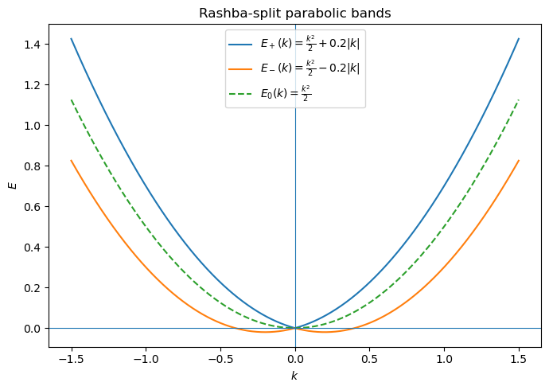

# Symmetry
我们来集中考虑一下空间反演对称性和时间反演对称性的效果，以及他们破缺之后会产生什么样的结构。和时间反演（一般是一个外磁场或者自发磁化）不同，空间反演在普通的教材里面并没有过多的涉及，不过他还是对应于很多非常简洁的物理现象。由于 inversion 是一个幺正对称性，属于晶体点群的对称性的一种，我们把它放在一个正常对称性的框架中去考虑。

我们先来定义什么是对称性。在我们的语境中，暂时先不考虑磁性带来的影响，也就是只考虑使得不带磁化的晶体结构不变的群，我们称为空间群 $G$，$G$ 中的操作称为 $R$。而 $R$ 操作的对象是各个原子的位置矢量 $\mathbf{r}_{i} \in \mathbb{R}^{3}$，所以 $R\in \mathbb{R}^{3\times 3}$。

什么是群呢？简单的来说，连续做两个 $G$ 中的操作，其效果都可以等同于 $G$ 中另一个操作。并且一定有一个什么都不做，并且每个操作都有逆，并且简单写个结合律，我们就完成了群的定义。

:::important
不严格、跳步、trying to be kirakira dokidoki 是本博客特色。虽然还没有做到闪闪发光心动不已，但是在此之前，请首先成为非人类。
:::

我们现在把他拉到 Hamiltonian 里面，对 Hamiltonian 的操作的集合我们暂且称为 $\{U_{R} :R\in G\}$，可以证明，$U_{R}$ 是 $R$ 诱导的一个群，且基本为 $R$ 的同态。如果不考虑自旋，则往往是一个同构。

我们先具体来看一下 $U_{R}$ 是什么。算符 $U_{R}$ 对一个波函数的作用以后，变换到的新波函数可以表示为
$$
\psi (\mathbf{r})\rightarrow U_{R} \psi (\mathbf{r}) =D( R) \psi \left( R^{-1}\mathbf{r}\right)
$$
这个式子表明：变换后的波函数在新坐标 $\mathbf{r}$ 的值等于原来坐标 $R^{-1}\mathbf{r}$ 的值，并且还会改变其中的内部自由度，比如自旋或者轨道。

举个例子，绕 $z$ 轴转 $2\pi $：
$$
\psi ^{\prime }(\mathbf{r}) =D_{1/2}( R_{z}) \psi \left( R_{z}^{-1}\mathbf{r}\right)
$$
其中：
$$
D_{1/2}( R_{z}) =\begin{pmatrix}
\mathrm{e}^{-i\pi } & 0\\
0 & \mathrm{e}^{i\pi }
\end{pmatrix}
$$
那么：
$$
\psi ^{\prime }( x,y,z) =-\psi ( -x,-y,z)
$$

同样的变换作用到 $p$ 轨道上，作用效果则是截然不同的。新的 $p$ 轨道是旧的三个 $p$ 轨道的混合，并且不会有其他的轨道混入。具体到这里，是这样的（我们把具体推导放在后面）
$$
\begin{pmatrix}
p_{x}(\mathbf{r})\\
p_{y}(\mathbf{r})\\
p_{z}(\mathbf{r})
\end{pmatrix}\rightarrow \begin{pmatrix}
\cos \theta  & -\sin \theta  & 0\\
\sin \theta  & \cos \theta  & 0\\
0 & 0 & 1
\end{pmatrix}\begin{pmatrix}
p_{x}\left( R^{-1}\mathbf{r}\right)\\
p_{y}\left( R^{-1}\mathbf{r}\right)\\
p_{z}\left( R^{-1}\mathbf{r}\right)
\end{pmatrix}
$$
我们发现，如果只考虑绕着 $z$ 轴转动，$p_{z}$ 自己跟自己玩；$p_{x} ,p_{y}$ 则是互相混，而且不会有其他成分混入。如果考虑所有的其他转动，则三个 $p$ 轨道是互相混但是不会有其他的混入。而 $s$ 轨道则是自己跟自己混。

如果在 $p$ 轨道基础上考虑自旋呢？我们就要变六个函数，这六个函数在一般的旋转下都会混在一起，但是不会有其他的混入。

做个总结，如果一个函数空间在某个操作群 $D( G)$ 下互相混，但是不会有其他的混入，我们称这个空间是这个群 $D( G)$ 的表示，由于往往 $G$ 和 $D( G)$ 同构，也可以不严格地称为 $G$ 的表示。

表示可以约化，也就是这个互相混可能是一群函数混在一起，其他一群混在一起，还有一些各玩各的，这时候可以把他们的空间拉出来写成 direct sum $V_{1} \oplus V_{2}$，因为他们不是互相影响的。约化到不能再约化就称为不可约表示。比如这个 $z$ 旋转群，$p_{z}$ 就是一个一维不可约表示，$\{p_{x} ,p_{y}\}$ 是一个二维不可约表示。维数就遵循向量空间的定义了。

同样的变换可以拉到产生湮灭算符上面，遵循态 / 波函数的变换。

我们现在知道什么是操作和群了，现在来看什么是普通的对称。普通的对称，其核心就是
$$
D( R) HD^{-1}( R) =H
$$
注意这里是对大 Hamiltonian 做的！如果是二次量子化，带产生湮灭算符！里面的**尚未对角化的**东西 $\mathcal{H}(\mathbf{k})$ 变的就是千奇百怪了。这个 $D( R)$ 就是作用在波函数上的算符。

一个核心的定理就是：$H$ 的所有本征态必构成 $D( R)$ 的表示，约化以后，同一不可约表示里的本征态能量必相同。不同的一般不同可能有偶然简并。因为同一不可约表示里的东西，假设有一个 $\psi _{1}$，要考虑另一个 $\psi _{2}$，把 $\psi _{2}$ 转一下就变成 $\psi _{1}$ 了而 Hamiltonian 没变过，所以能量是简并的。

我们进一步简化，只考虑有限群，晶体的话取个 PBC。有限群的表示就那么几种，而且都可以搞成幺正表示，所以那些 $D( R)$ 全是幺正的（很容易理解因为他不能凭空变东西出来）。表示可以用特征标表去 label，特征标表有两个正交定理。所以我们解出来的东西每个都能 label，或者我们知道其中一个东西可以去通过特征标表计算得到他属于什么表示或者是分裂成什么表示。但是那个能量的顺序没办法通过群论直接得到。

当然这些只是一个概述，而且群论我也忘记太多了，我们还是上具体例子。

于是群论主要分成两条线：第一个是研究空间群的结构，第二个是研究各种量怎么变化，我们先看后者，从最简单的 inversion symmetry 开始。

# Inversion, or centrosymmetry
我们考虑这个晶体对称群：
$$
G=\{1,i\}
$$
其中反演操作
$$
i=\begin{pmatrix}
-1 & 0 & 0\\
0 & -1 & 0\\
0 & 0 & -1
\end{pmatrix}
$$
这不是一个 proper rotation。我们来看看他对各个东西的作用，对于波函数，假设自旋守恒或者分离：
$$
D( i) \psi _{n\mathbf{k}}(\mathbf{r}) :=\hat{P} \psi _{n\mathbf{k}}(\mathbf{r}) =\psi _{n\mathbf{k}}( -\mathbf{r})
$$
那么由 Bloch 定理：
$$
\psi _{n\mathbf{k}}( -\mathbf{r}) =u_{n\mathbf{k}}( -\mathbf{r})\mathrm{e}^{+i\mathbf{k} \cdot \mathbf{r}}
$$
所以实际上得到了一个 $-\mathbf{k}$ 的态，按照不严格的语言写，可以称为 $\mathbf{k}\xrightarrow{i} -\mathbf{k}$。但问题是我们并不知道这个 $-\mathbf{k}$ 是由那些态组成的，如果没有简并，则就是 $\psi _{n,-\mathbf{k}}(\mathbf{r})$ 同一条能带。但如果有简并，反演以后可能得到多个能带的组合，也就是
$$
\hat{P} \psi _{n\mathbf{k}}(\mathbf{r}) =\sum\limits _{m} B_{mn}(\mathbf{k}) \psi _{m,-\mathbf{k}}(\mathbf{r})
$$
这个 $B_{mn}$ 称为 sewing matrix。但是反演不会跑到非简并的 $-\mathbf{k}$ 态上，由于相同表示基本就等同于相同能量（暂时不讨论偶然简并，因为我们始终假设微扰的存在）可以得到
$$
B_{mn}(\mathbf{k}) =\langle \psi _{m,-\mathbf{k}} |\hat{P} |\psi _{n,\mathbf{k}} \rangle 
$$
可以得到 $B_{mn}( -\mathbf{k}) =( B_{nm}(\mathbf{k}))^{*}$。这个类似的东西对于时间反演对称性也有，并且在 TRIM point 的 TR sewing matrix 可以用来求 $\mathbb{Z}_{2}$ topological invariant。注意在 IIM point 时，波函数为 parity 的本征态。

破坏了自旋旋转对称性，则还是有 $E_{n}(\mathbf{k}) =E_{n}( -\mathbf{k})$，只不过 $n$ 是 spin-orbit labeled band index 了，inversion 并不操作自旋。

如果同时有 time reversal symmetry，则
$$
PT:\mathbf{k} ,\mathbf{S}\rightarrow \mathbf{k} ,-\mathbf{S}
$$
因此对于每个点 $E_{\mathbf{k} \uparrow } =E_{\mathbf{k} \downarrow }$，不需要 spin rotation symmetry 也能保证这点。

我们再来看对于产生湮灭算符的操作，和态是一样的。
$$
Pc_{n\mathbf{k}}^{\dagger } P^{-1} =\sum\limits _{m} B_{mn}(\mathbf{k}) c_{m,-\mathbf{k}}^{\dagger }
$$
对于轨道则需要加上轨道的变换，比如说石墨烯：
$$
Pc_{A\mathbf{k}}^{\dagger } P^{-1} =c_{B,-\mathbf{k}}^{\dagger }
$$
那么，$\left\{c_{A\mathbf{k}}^{\dagger } ,c_{B\mathbf{k}}^{\dagger }\right\}$ 是一组基，表现为
$$
P\Psi _{\mathbf{k}} P^{-1} =P\begin{pmatrix}
c_{A\mathbf{k}}\\
c_{B\mathbf{k}}
\end{pmatrix} P^{-1} =\begin{pmatrix}
c_{B-\mathbf{k}}\\
c_{A-\mathbf{k}}
\end{pmatrix} =\tau _{x} \Psi _{-\mathbf{k}}
$$
所以表现为 $\tau _{x}$，不过定义方式依赖于基相位规范和位置（其实也是规范）的选取。对于 NN graphene Hamiltonian，假如他是 inversion invariant 的，则应该有
$$
PHP^{-1} =H
$$
作用到 $\mathcal{H}(\mathbf{k})$ 上则有
$$
\tau _{x}\mathcal{H}(\mathbf{k}) \tau _{x} =\mathcal{H}( -\mathbf{k})
$$
我们发现的确满足。之前我们推过了 Kagome，我们来看一下 Kagome 会发生什么，先从位置的产生湮灭算符开始，定义反演中心为六边形的中心：
$$
\begin{align*}
c_{\mathbf{R} A}^{\dagger } & \rightarrow c_{-\mathbf{R} -\mathbf{a}_{1} ,A}^{\dagger }\\
c_{\mathbf{R} B}^{\dagger } & \rightarrow c_{-\mathbf{R} -\mathbf{a}_{2} ,B}^{\dagger }\\
c_{\mathbf{R} C}^{\dagger } & \rightarrow c_{-\mathbf{R} +\mathbf{a}_{1} -\mathbf{a}_{2} ,C}^{\dagger }
\end{align*}
$$
代入之前的定义
$$
c_{A\mathbf{k}}^{\dagger } =\frac{1}{\sqrt{N}}\sum\limits _{\mathbf{R}}\mathrm{e}^{i\mathbf{k} \cdot (\mathbf{R} +\mathbf{r}_{A})} c_{\mathbf{R} A}^{\dagger }
$$
得到：
$$
c_{A\mathbf{k}}^{\dagger }\rightarrow \frac{1}{\sqrt{N}}\sum\limits _{\mathbf{R}}\mathrm{e}^{i( -\mathbf{k}) \cdot (\mathbf{R} +\mathbf{r}_{A})} c_{\mathbf{R} ,A}^{\dagger } =c_{-A\mathbf{k}}^{\dagger }
$$
其他两个类似，因此我们得到
$$
P\Psi _{\mathbf{k}} P^{-1} =\Psi _{\mathbf{k}}
$$
由此我们也看到这个变换的形式依赖于相位的选取。如果 $c_{\mathbf{k}}$ 选取的规范不一样，比如不把 $\mathbf{r}_i$ 放到相位里面去，那么最后得到的矩阵就是不一样的，并非单位矩阵，而是一个三个相位的对角矩阵。

推导这些的时候，最安全的做法当然是从 position space 开始。

# Lack of inversion symmetry: Dresselhaus or Rashba SOC

我们来看一下 lack of inversion symmetry 的结果。如果在结构上就缺少 inversion symmetry，比如说一个表面，那么有可能会有一个电场（参见功函数有关），我们记为 $E\hat{z}$，或者是外加电场。

> 顺带一提，缺乏空间反演对称性可能造成一个自发的电场，也就是铁电，往往有压电效应。（不严谨）

考虑自旋轨道耦合，其作用一般是劈裂自旋的简并：
$$
E_{\pm }(\mathbf{k}) =E_{0}(\mathbf{k}) \pm | b(\mathbf{k})| 
$$
可以看成是随动量变化的有效磁场，不过如果 TRS 还在，仍会有 Kramers pair，也就是一个 $\mathbf{k}$ 和另一个 $-\mathbf{k}$ 的能量一样，但是具体的能带编号我们是不知道的；而在 TRIM 点则是保证二重简并。

说回来，表面的一个电场可能造成如下的 Rashba term：
$$
H_{R} =\alpha _{R}(\mathbf{\sigma } \times \mathbf{k}) \cdot \hat{z} =\alpha _{R}( \sigma _{x} k_{y} -\sigma _{y} k_{x})
$$
这是最简单的形式，并且是 TR 不变的。此时，有效磁场是垂直于动量的，导致手性自旋纹理。我们看有效磁场
$$
b_{R}(\mathbf{k}) \varpropto \alpha _{R}(\hat{z} \times \mathbf{k})
$$
那么 $\alpha _{R}$ 的两种符号就代表了两种旋转方向, e.g. chirality。算出的能量则是有一个和 $\mathbf{k}$ 有关的偏移
$$
E_{\pm }(\mathbf{k}) =E_{0}(\mathbf{k}) \pm \alpha _{R}| \mathbf{k}| 
$$
这个用简并微扰法可以很简单地求出，我们在这里画个图。

> Dirac fermion 的话，就是 Kane-Mele model 了，这里还要区分 intrinsic 和 exrinsic，而 Rashba 是 extrinsic。关于 Kane-Mele model，之后再讲，在目前的这个路线下只能算是支线。

另外一种是晶体本身缺乏 inversion symmetry，称为 Dresselhaus SOC。二维情况常写成
$$
H_{D} =\beta ( \sigma _{x} k_{x} -\sigma _{y} k_{y})
$$
有效磁场是 $\beta ( k_{x} ,-k_{y})$，他的自旋方向由晶轴决定。除此之外还有立方项
$$
H_{D}^{( 3)} \varpropto +\beta d^{2} k_{x} k_{y}( \sigma _{x} k_{y} -\sigma _{y} k_{x})
$$
bulk 则可以写成
$$
H_{D} \varpropto p_{x} \sigma _{x}\left( p_{y}^{2} -p_{z}^{2}\right) +\text{other 2 rotation of } xyz
$$

> 这个具体怎么推好像又是一个新坑。

# DM Interaction

DM interaction，作为另一种 exchange interaction between moments，也和空间反演对称性是有关的。我们先来推导 DMI 的形式，也就是：
$$
\mathbf{D} \cdot (\mathbf{S}_{i} \times \mathbf{S}_{j}) =\epsilon _{\alpha \beta \gamma } D^{\alpha } S_{i}^{\beta } S_{j}^{\gamma }
$$
这样的形式。DM interaction 从 Hubbard model 中源自于 hopping term 中的 SOC 贡献。我们假设
$$
H_{t} =\sum\limits _{\alpha \beta } c_{i\alpha }^{\dagger }\left( t\delta _{\alpha \beta } +i\mathbf{\lambda }_{ij} \cdot \mathbf{\sigma }_{ij}^{\alpha \beta }\right) c_{j\beta } +\mathrm{h.c.}
$$
放到格点模型里，SOC 就相当于有自旋翻转的 hopping，导致 intrinsically 自旋不是一个好量子数。而 Hubbard $U$ term 仍然取
$$
H_{U} =\sum\limits _{i} Un_{i\uparrow } n_{i\downarrow }
$$
推导的技巧是先对每一对 $ij$ 的 hopping term 做自旋空间的对角化，具体来说，定义
$$
\rho =\sqrt{t^{2} +| \lambda | ^{2}} ,\hat{n} =\frac{\mathbf{\lambda }}{\lambda }
$$
则 hopping term 可以写成
$$
H_{t}^{ij} =\sum\limits _{\alpha \beta } c_{i\alpha }^{\dagger } \rho (\cos \theta \ \delta _{\alpha \beta } +i\sin \theta \ \hat{n} \cdot \mathbf{\sigma }_{ij}) c_{j\beta } +\mathrm{h.c.}
$$
其中 $\cos \theta =t/\rho ,\sin \theta =\lambda /\rho $，可以看到括号内是一个旋转 $2\theta $ 的算符，定义新的费米子
$$
\begin{pmatrix}
\tilde{c}_{j\uparrow }\\
\tilde{c}_{j\downarrow }
\end{pmatrix} =\mathrm{e}^{i\theta (\hat{n} \cdot \sigma )}\begin{pmatrix}
c_{j\uparrow }\\
c_{j\downarrow }
\end{pmatrix}
$$
那么一对 site 就变成标准的形式
$$
H_{t}^{ij} =\sum\limits _{\alpha } \rho c_{i\alpha }^{\dagger }\tilde{c}_{j\alpha }
$$
二阶微扰的结果就是
$$
H_{\mathrm{eff}} =\frac{4\rho ^{2}}{U}(\mathbf{S}_{i} \cdot \tilde{\mathbf{S}}_{j}) -\frac{1}{4}\rightarrow \frac{4\rho ^{2}}{U}(\mathbf{S}_{i} \cdot R_{\hat{n}}( 2\theta ) \cdot \mathbf{S}_{j})
$$
利用：
$$
R_{\hat{n}}( 2\theta )\mathbf{S}_{j} =\cos 2\theta \ \mathbf{S}_{j} +\sin 2\theta \ \hat{n} \times \mathbf{S}_{j} +( 1-\cos 2\theta )\hat{n}(\hat{n} \cdot \mathbf{S}_{j})
$$
得到：
$$
H_{\mathrm{eff}} =\frac{4\rho ^{2}}{U}\{\cos 2\theta \ \mathbf{S}_{i} \cdot \mathbf{S}_{j} -\sin 2\theta \ \hat{n} \cdot (\mathbf{S}_{i} \times \mathbf{S}_{j}) +( 1-\cos 2\theta )(\hat{n} \cdot \mathbf{S}_{i})(\hat{n} \cdot \mathbf{S}_{j})\}
$$
利用 $\tan \theta =\lambda /t$ 和万能公式得到：
$$
H_{\mathrm{eff}} =J_{ij} \ \mathbf{S}_{i} \cdot \mathbf{S}_{j} +\mathbf{D}_{ij} \cdot (\mathbf{S}_{i} \times \mathbf{S}_{j}) +K(\hat{n} \cdot \mathbf{S}_{i})(\hat{n} \cdot \mathbf{S}_{j})
$$
其中的各项参数：
$$
\begin{cases}
J_{ij} =\frac{4}{U}\left( t_{ij}^{2} -\lambda _{ij}^{2}\right)\\
\mathbf{D}_{ij} =-\frac{8t}{U}\mathbf{\lambda }_{ij}\\
K=\frac{8\lambda ^{2}}{U}
\end{cases}
$$
由于 exchange interaction 必然是一个张量，9 个分量。$J_{ij}$ 是 isotropic 分量，DMI 是 antisymmetric，而 $K$ 是 symmetric anisotropic 分量，9=1+3+5 自由度是正好的。原则上 $K$ 有 5 个分量，不过这个模型只求出来一个。

> 这个物理也是因为 inversion symmetry 的破缺带来一个电场，而电子在 hopping 的过程中看到这个电场，由于电子的运动，它实际上看到磁场，而这个磁场是电场在不同参考系变的。因此 DMI 系数就衡量这个有效磁场的大小。
> 参见 [肖江老师的视频](https://www.bilibili.com/video/BV1kBpEeuEWM)

$\lambda _{ij}$ 的方向就给出了一个旋转的手性，不管 $K$ 项，假设两个自旋夹角为 $\phi $，且垂直于 $\mathbf{D}$，那么能量是：
$$
\frac{4\rho ^{2}}{U}\{\cos 2\theta \ \cos \phi -\sin 2\theta \ \sin \phi \} \varpropto \cos( 2\theta +\phi )
$$
在 $\phi =\pi -2\theta $ 的时候取最小，(这里是 AFM 基态)，说明有 spin canting，在反铁磁基础上，倾角为
$$
\theta _{\text{canted}} =2\theta =2\arctan\frac{\lambda }{t} \approx \frac{2\lambda }{t}
$$
最后取了 small SOC limit。canting 在 AFM 会给出 FM 分量。对于铁磁，一种可能是得到 spiral order，比如 YMn$_{6}$Sn$_{6}$。同时也可以想见的，这玩意会扭相邻的磁矩从而稳定 skyrmion 这类的东西。

现在我们回到 centrosymmetry，如果有 inversion  symmetry，且 inversion center 在两个磁性原子的中心，那么反演以后，
$$
\mathbf{S}_{i}\rightarrow \mathbf{S}_{j} ,\mathbf{S}_{j}\rightarrow \mathbf{S}_{i}
$$
因为他们是 pseudovectors，不变号只是位置变化了。Hamiltonian 的变化是
$$
H_{\text{DM}}\rightarrow \hat{n} \cdot (\mathbf{S}_{j} \times \mathbf{S}_{i}) =-H_{\text{DM}}
$$
如果有 inversion symmetry 那么 $H_{\text{DM}} =0$。对于其他对称性也有类似的判断方法。

相关的材料：MnBi，La$_{2}$CuO$_{4}$, BiFeO$_{3}$
> 这个我们下次再讲。follow V. V. Mazurenko et al., Zh. Eksp. Teor. Fiz. 159, 598 (2021).

# Time reversal symmetry

我们再来看看 time reversal operator 和 time reversal symmetry。TRS 和普通的对称性不太一样。但是重点还是看态怎么变 / 算符怎么变 / 对称说明了什么.

时间反演算符 $T$ 必须满足：
$$
TiT^{-1} =-i
$$
为什么呢? 因为
$$
TxT^{-1} =x,TpT^{-1} =-p
$$
因此
$$
T[ x,p] T^{-1} =T[ x,-p] T^{-1}
$$
就可以得到上面的结论。这个性质我们叫反线性，也就是
$$
T( ax+by) T^{-1} =a^{*}\left( TxT^{-1}\right) +b^{*}\left( TyT^{-1}\right)
$$
因此可以把 $T$ 写一个幺正算符和复共轭算符的乘积
$$
T=UK
$$
其中：$KaK=a^{*}$。对于态的作用，要分有无自旋来说明，对于 spinless case，由于：
$$
T_{\mathbf{R}} |\psi _{n\mathbf{k}} \rangle =\mathrm{e}^{i\mathbf{k} \cdot \mathbf{R}} |\psi _{n\mathbf{k}} \rangle 
$$
并且：
$$
[ T,T_{\mathbf{R}}] =0
$$
因此：
$$
T_{\mathbf{R}} T|\psi _{n\mathbf{k}} \rangle =T( T_{\mathbf{R}} |\psi _{n\mathbf{k}} \rangle ) =T\left(\mathrm{e}^{i\mathbf{k} \cdot \mathbf{R}} |\psi _{n\mathbf{k}} \rangle \right) =\mathrm{e}^{-i\mathbf{k} \cdot \mathbf{R}} T|\psi _{n\mathbf{k}} \rangle 
$$
所以我们发现 $T|\psi _{n\mathbf{k}} \rangle $ 是一个 $-\mathbf{k}$ 的态，但是我们不知道其中的能带编号。只有非简并情况下，我们可以确定他属于同一条连续的能带。
$$
T|\psi _{n\mathbf{k}} \rangle =\mathrm{e}^{i\phi (\mathbf{k})} |\psi _{n-\mathbf{k}} \rangle 
$$
由于 $T^{2} =+1$，$\phi (\mathbf{k}) =0$。如果有简并的话，需要定义 sewing matrix，这个我们等下直接推 spinful 的情况。

$T^{2} =\pm 1$ 的证明：由于 $T=UK$，那么
$$
T^{2} =UKUK=UU^{*} =U\left( U^{\dagger }\right)^{T} =\phi 
$$
由于 $T^{2}$ 必定回到原来的态，其作用是一个相位 $\phi $。那么变换以后得到：
$$
U=\phi U^{T} =\phi \left( \phi U^{T}\right)^{T} =\phi ^{2} U\Longrightarrow \phi ^{2} =1
$$
因此 $\phi =\pm 1$。而 spinless 时，没有内部自由度的操作，$T$ 直接是 $K$，因此 $T^{2} =1$

对于 spin-1/2 情况，由于时间反演也要把自旋翻转，而自选的旋转有 $R( \pi )^{2} =-1$，因此 $T^{2} =-1$。可以取成 $T=i\sigma _{y} K$ in spin space，具体一些是
$$
|\uparrow \rangle \rightarrow -|\downarrow \rangle ,\ |\downarrow \rangle \rightarrow |\uparrow \rangle 
$$
因此矩阵表示是
$$
\begin{pmatrix}
0 & 1\\
-1 & 0
\end{pmatrix} K=i\sigma _{y} K
$$
对于产生湮灭算符：
$$
c_{\mathbf{k} \uparrow }^{\dagger }\rightarrow -c_{-\mathbf{k} \downarrow }^{\dagger } ,c_{\mathbf{k} \downarrow }^{\dagger }\rightarrow c_{-\mathbf{k} \uparrow }^{\dagger }
$$
一般取基，如果 spinless 是时间反演不变的，那么
$$
\mathcal{H}(\mathbf{k}) =\mathcal{H}^{*}( -\mathbf{k})
$$
如果 spinful，类似于 BHZ model 的这种形式就是 TRS 的。
$$
\mathcal{H} =\sum\limits _{\mathbf{k}}\left( c_{\mathbf{k} \uparrow }^{\dagger }\mathcal{H}(\mathbf{k}) c_{\mathbf{k} \uparrow } +c_{\mathbf{k} \downarrow }^{\dagger }\mathcal{H}^{*}( -\mathbf{k}) c_{\mathbf{k} \downarrow }\right)
$$
在此基础上可以加入 SOC 等等。

如果有 TRS，最重要的事情是有 Kramers pair，如果自旋不守恒，则任意一个 $n\mathbf{k}$ 态必有一个 $m,-\mathbf{k}$ 态和他能量是一样的。而在 $\mathbf{k} =-\mathbf{k} +\mathbf{K}$ 的 TRIM，必有二重简并。在这个点则是有 sewing matrix：
$$
B_{mn}(\mathbf{k}) =\langle \psi _{m\mathbf{k}} |T|\psi _{n\mathbf{k}} \rangle ，\mathbf{k} \in \text{{TRIM}}
$$
由于有一个关系
$$
\langle T\phi |T\psi \rangle =\langle \psi |\phi \rangle 
$$
证明：
$$
\begin{align*}
\langle T\phi |T\psi \rangle  & =\langle UK\phi |UK\psi \rangle \\
 & =\langle K\phi |K\psi \rangle 
\end{align*}
$$
展开成基得到
$$
|K\psi \rangle =K\sum\limits _{\mathbf{r}} \langle \mathbf{r} |\psi \rangle |\mathbf{r} \rangle =\sum\limits _{\mathbf{r}} \langle \psi |\mathbf{r} \rangle |\mathbf{r} \rangle 
$$
即可证明。这里是定义了 $K|\mathbf{r} \rangle =|\mathbf{r} \rangle $。注意这个定义不是对任何一组基都成立，比如如果定义 $|\mathbf{r} \rangle $ 是 real 的那 $|\mathbf{p} \rangle $ 就会变成 imaginary 的。但是这个等式本身并不依赖于这些基变换定义，因为相位抵消了。

可证明在 TRIM 点的 $\mathbf{k}$，由于 $T^{-1} =-T$
$$
\begin{align*}
\langle \psi _{m\mathbf{k}} |T|\psi _{n\mathbf{k}} \rangle  & =\langle \psi _{m\mathbf{k}} |T^{-1} TT|\psi _{n\mathbf{k}} \rangle \\
 & =\langle T\psi _{m\mathbf{k}} |TT\psi _{n\mathbf{k}} \rangle \\
 & =\langle T\psi _{n\mathbf{k}} |\psi _{m\mathbf{k}} \rangle \\
 & =-\langle \psi _{n\mathbf{k}} |T|\psi _{m\mathbf{k}} \rangle 
\end{align*}
$$
因此 $B_{mn}(\mathbf{k}) =-B_{nm}(\mathbf{k})$ 是一个反对称矩阵并且 unitary，可以定义 Pfaffian $\delta _{i}$。所有 TRIM 的这个值 $\delta _{i}$ 的乘积就是 $\mathbb{Z}_{2}$ index。当然需要在半个 BZ 上保证根号分支的连续性。

